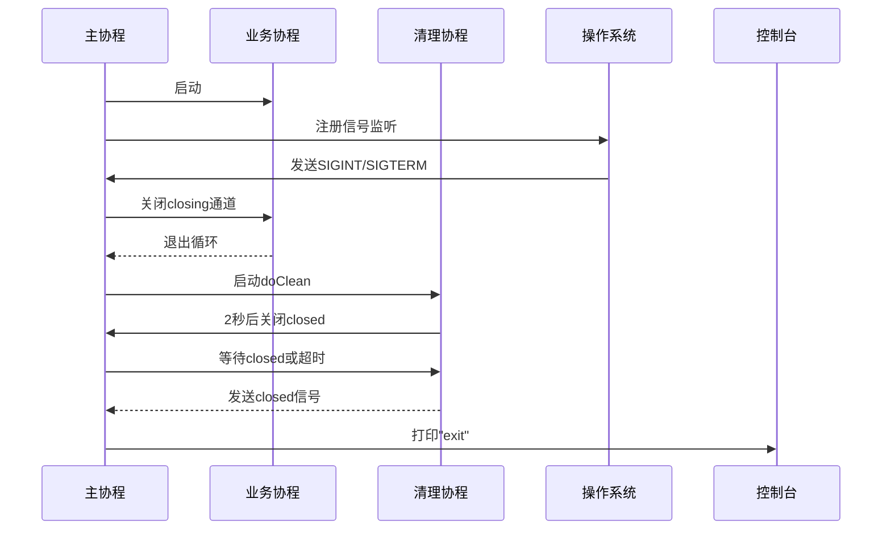
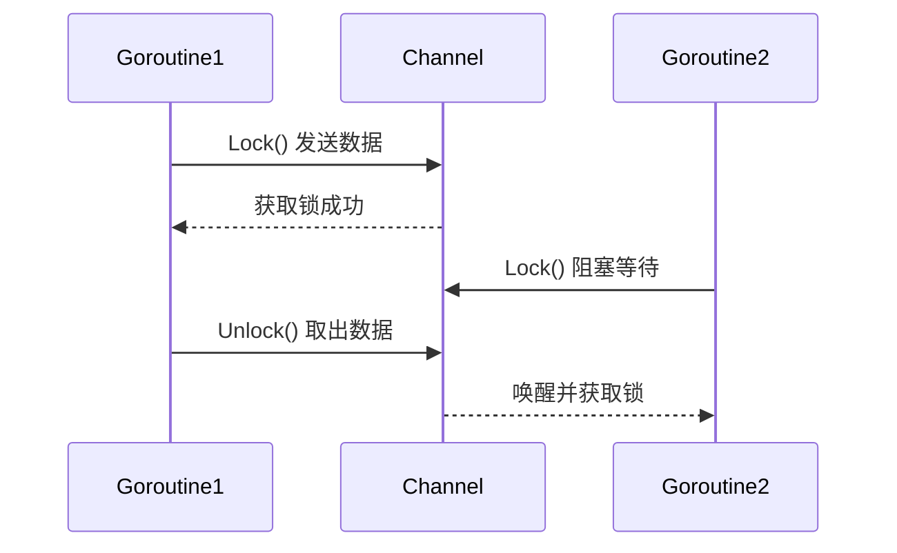

Go语言中的`context`包是并发编程中管理goroutine生命周期和跨API传递数据的核心工具。以下从主要功能、接口方法、使用场景及最佳实践进行详细介绍：

---

### 一、核心功能
1. **生命周期管理**  
   通过取消信号、超时或截止时间（Deadline）控制多个goroutine的退出。例如，父goroutine取消后，所有关联的子goroutine会自动终止，避免资源泄漏。

2. **跨API数据传递**  
   使用键值对（Key-Value）在请求处理链中安全传递数据，如跟踪ID、认证信息等，确保线程安全。

3. **信号同步机制**  
   提供`Done()`管道监听取消或超时事件，结合`select`实现非阻塞的并发控制。

---

### 二、Context接口方法
`Context`是一个接口，定义四个核心方法：
1. **`Deadline() (time.Time, bool)`**  
   返回上下文超时的绝对时间，若未设置返回`false`，常用于设置IO操作的超时时间。

2. **`Done() <-chan struct{}`**  
   返回只读管道，当上下文被取消或超时时关闭，触发相关goroutine退出。

3. **`Err() error`**  
   返回上下文关闭的原因，如`context.Canceled`（主动取消）或`context.DeadlineExceeded`（超时）。

4. **`Value(key interface{}) interface{}`**  
   根据键获取上下文中的值，适用于传递请求域数据（如用户ID），键需自定义类型避免冲突。

---

### 三、常用Context类型及创建函数
1. **`context.Background()`**  
   根上下文，所有其他上下文均派生自它，通常用于`main`函数或测试中。

2. **`context.TODO()`**  
   占位符上下文，用于未确定具体类型时的临时场景。

3. **派生上下文**
    - **`WithCancel(parent)`**：创建可手动取消的上下文，返回`cancel`函数。
    - **`WithTimeout(parent, duration)`**：设置超时时间，到期自动取消。
    - **`WithDeadline(parent, time)`**：指定绝对时间作为截止点。
    - **`WithValue(parent, key, value)`**：安全传递请求域数据。

**示例代码：超时控制**
```go
ctx, cancel := context.WithTimeout(context.Background(), 2*time.Second)
defer cancel()

select {
case <-time.After(3 * time.Second):
    fmt.Println("操作完成")
case <-ctx.Done():
    fmt.Println("超时:", ctx.Err()) // 输出：超时: context deadline exceeded
}
```

---

### 四、典型应用场景
1. **HTTP/RPC请求处理**  
   服务端为每个请求创建上下文，设置超时或截止时间，防止长时间阻塞。

2. **数据库或外部服务调用**  
   在链式调用中传递上下文，确保某一步失败时，后续操作立即终止。

3. **链路追踪与日志**  
   通过`WithValue`传递`traceID`，统一日志标识同一请求的所有操作。

4. **优雅关闭服务**  
   主程序取消根上下文，所有关联的goroutine接收信号后清理资源并退出。

---

### 五、最佳实践
1. **传递规则**
    - Context作为函数的第一参数传递，而非嵌入结构体。
    - 禁止传递可选参数，仅传递请求域的必要数据。

2. **超时设置**  
   从上游到下游的超时应逐层递减，避免级联超时失效。

3. **避免滥用Value**  
   仅传递必要的请求域数据，避免将Context作为“全局变量”使用。

---

### 六、设计原理
- **树形结构**：Context通过父子关系形成树形结构，父节点取消时，所有子节点同步取消。
- **线程安全**：Context的实现保证了并发访问的安全性。

---

通过合理使用`context`，可以显著提升Go程序的健壮性和可维护性，尤其在微服务和分布式系统中，它是实现优雅并发控制的基石。

---

在Go语言中，`context`的传值机制是通过键值对（Key-Value）实现的，用于在请求处理链中安全传递请求范围的数据。以下是其核心机制、使用场景及注意事项的详细解析：

---

### 一、传值的基本流程
1. **存储值**  
   使用`context.WithValue(parent Context, key, value)`创建新的上下文，继承父上下文的所有值，并添加新的键值对。例如：
   ```go
   type myKey string // 自定义键类型避免冲突
   ctx := context.WithValue(parentCtx, myKey("userID"), 123)
   ```

2. **检索值**  
   通过`Value(key interface{}) interface{}`方法获取值，若当前上下文无此键，则沿链向上查找父上下文：
   ```go
   userID := ctx.Value(myKey("userID")).(int) // 类型断言
   ```

---

### 二、传值的特点
1. **链式查找**  
   子上下文覆盖父上下文的同名键值，但仅影响自身及更下层。例如，父上下文设置`key=1`，子上下文设置`key=2`，则子上下文中`Value(key)`返回`2`，而父上下文仍为`1`。

2. **类型安全**  
   键应使用自定义类型（如`type traceID string`），避免不同包的同名字符串键冲突。例如：
   ```go
   type RequestContextKey string // 自定义键类型
   ctx = context.WithValue(ctx, RequestContextKey("traceID"), "abc123")
   ```

3. **不可变数据**  
   上下文的值一旦设置不可修改，只能通过派生新上下文覆盖键值。

---

### 三、典型应用场景
1. **请求范围元数据**  
   传递请求ID、用户认证信息、日志追踪ID等，避免在函数参数链中显式传递。例如：
   ```go
   // 中间件中注入用户ID
   ctx = context.WithValue(r.Context(), userKey, userID)
   ```

2. **中间件传递数据**  
   HTTP中间件可将请求信息（如IP、请求头）注入上下文，供后续处理函数使用：
   ```go
   func loggingMiddleware(next http.Handler) http.Handler {
       return http.HandlerFunc(func(w http.ResponseWriter, r *http.Request) {
           ctx := context.WithValue(r.Context(), "ip", r.RemoteAddr)
           next.ServeHTTP(w, r.WithContext(ctx))
       })
   }
   ```

3. **跨层服务调用**  
   在微服务中，通过上下文传递调用链的元数据（如超时、跟踪ID），实现链路追踪。

---

### 四、最佳实践与注意事项
1. **键的设计规范**
   - **避免内置类型**：如`string`或`int`，推荐使用包内私有类型（如`type privateKey struct{}`）。
   - **封装存取函数**：提供`WithXxx`和`FromXxx`函数，隐藏键的实现细节。例如：
     ```go
     func WithUserID(ctx context.Context, id int) context.Context {
         return context.WithValue(ctx, userKey{}, id)
     }
     func UserIDFromContext(ctx context.Context) (int, bool) {
         id, ok := ctx.Value(userKey{}).(int)
         return id, ok
     }
     ```

2. **值的使用限制**
   - **轻量级数据**：仅传递必要的小型数据（如ID、状态码），避免存储复杂结构体或大对象。
   - **非替代参数**：不应用上下文传递函数的核心参数，仅作为请求域的补充信息。

3. **类型断言处理**  
   从上下文获取值时需显式类型断言，并处理可能的`nil`或类型错误：
   ```go
   if userID, ok := ctx.Value(userKey).(int); ok {
       // 安全使用userID
   } else {
       // 处理缺失或类型错误
   }
   ```

4. **并发安全性**  
   上下文本身是线程安全的，但存储的可变值（如切片、映射）需自行实现同步。

---

### 五、常见陷阱
1. **键冲突**  
   使用公共字符串（如`"id"`）作为键时，不同包的同名键可能导致数据覆盖。  
   **解决方案**：定义包级私有类型作为键。

2. **过度传值**  
   滥用上下文传递业务逻辑参数，导致代码可读性下降。例如：
   ```go
   // 错误示例：用上下文传递分页参数
   ctx = context.WithValue(ctx, "page", 1)
   ```

---

### 六、源码简析
`context.WithValue`返回的`valueCtx`结构体包含键值对，其`Value()`方法优先返回自身键值，未命中时递归调用父上下文的`Value()`：
```go
type valueCtx struct {
    Context
    key, val interface{}
}

func (c *valueCtx) Value(key interface{}) interface{} {
    if c.key == key {
        return c.val
    }
    return c.Context.Value(key) // 递归查找父上下文
}
```

---

通过合理使用上下文传值，可以在保证线程安全的前提下，实现跨层数据传递，提升代码的整洁性和可维护性。


---

Go语言中`context`的取消机制是并发编程中控制goroutine生命周期的重要功能，通过信号传递实现多级任务的协同终止。以下从**触发方式**、**传播机制**、**监听方法**、**典型场景**及**注意事项**进行详细介绍：

---

### 一、触发取消的两种方式
1. **手动触发**  
   通过`context.WithCancel(parent)`创建可取消的上下文，调用返回的`cancel()`函数主动触发取消。  
   **示例**：
   ```go
   ctx, cancel := context.WithCancel(context.Background())
   defer cancel() // 确保资源释放
   go func() {
       select {
       case <-ctx.Done():
           fmt.Println("收到取消信号") 
       }
   }()
   cancel() // 手动触发取消
   ```
   适用场景：用户主动终止操作（如停止文件下载）、服务端中断请求处理。

2. **自动触发**  
   通过超时（`WithTimeout`）或截止时间（`WithDeadline`）自动触发取消。  
   **示例**（超时）：
   ```go
   ctx, cancel := context.WithTimeout(context.Background(), 2*time.Second)
   defer cancel()
   select {
   case <-time.After(3 * time.Second): // 任务耗时3秒
       fmt.Println("任务完成")
   case <-ctx.Done():
       fmt.Println("超时取消:", ctx.Err()) // 输出：context deadline exceeded
   }
   ```
   适用场景：数据库查询超时、HTTP请求限时响应。

---

### 二、传播机制：树形结构继承
1. **父子关系**  
   Context通过树形结构组织，父Context取消时，所有派生出的子Context会自动取消。例如：
   ```go
   parentCtx, parentCancel := context.WithCancel(context.Background())
   childCtx, _ := context.WithCancel(parentCtx)
   parentCancel() // 同时取消childCtx
   <-childCtx.Done() // 子Context收到信号
   ```
   这种设计确保了取消信号的级联传递，避免资源泄漏。

2. **独立取消能力**  
   子Context可通过自身`cancel()`独立取消，不影响父Context。例如，在微服务中，子任务可独立终止而不影响主流程。

---

### 三、监听取消信号的方法
1. **通过`Done()`通道**  
   使用`select`监听`ctx.Done()`管道，实现非阻塞响应：
   ```go
   func worker(ctx context.Context) {
       for {
           select {
           case <-ctx.Done():
               cleanup() // 资源清理
               return
           default:
               // 正常执行任务
           }
       }
   }
   ```

2. **检查`Err()`原因**  
   通过`ctx.Err()`判断取消类型：
   - `context.Canceled`：手动取消
   - `context.DeadlineExceeded`：超时或截止时间触发。

---

### 四、典型应用场景
1. **HTTP/RPC服务**  
   服务端为每个请求创建带超时的Context，超时后终止数据库查询等下游操作，防止客户端长时间等待。

2. **并发任务控制**  
   批量下载文件时，主任务取消后，所有子下载协程通过`ctx.Done()`同步终止。

3. **优雅关闭服务**  
   主程序调用根Context的`cancel()`，触发所有关联协程清理资源并退出。

---

### 五、注意事项
1. **及时调用`cancel()`**  
   即使使用`WithTimeout`或`WithDeadline`，仍需`defer cancel()`释放资源，避免极端情况下内存泄漏。

2. **避免过度依赖Value传递**  
   Context的核心是取消机制，传递数据应仅限于请求域必要信息（如traceID），而非业务逻辑参数。

3. **信号处理需主动监听**  
   Context仅传递信号，业务代码需通过`Done()`主动响应，否则goroutine可能无法终止（如未使用`select`的死循环）。

---

### 六、底层实现原理
- **树形结构**：通过链表实现父子关系，父节点取消时递归触发子节点取消。
- **线程安全**：内部使用互斥锁（mutex）保证并发安全性。

---

通过合理使用Context的取消机制，可以显著提升程序的健壮性，尤其在分布式系统和高并发场景中，它是实现资源可控性、避免“僵尸”协程的关键工具。


---


Go语言中`context`的超时取消机制是管理并发任务生命周期的核心功能，通过设置超时时间或截止时间自动终止关联的goroutine，避免资源泄漏和长时间阻塞。以下是其核心机制及使用详解：

---

### 一、超时取消的创建方式
1. **`WithTimeout`：相对时间超时**  
   通过设置一个相对时间段（如3秒），超时后上下文自动取消，适用于需要固定时间限制的场景。
   ```go
   ctx, cancel := context.WithTimeout(context.Background(), 3*time.Second)
   defer cancel() // 确保资源释放
   ```

2. **`WithDeadline`：绝对时间截止**  
   指定一个具体的截止时间点（如`time.Now().Add(5*time.Second)`），到达该时间后自动取消，适用于需要精确时间控制的场景。
   ```go
   deadline := time.Now().Add(5 * time.Second)
   ctx, cancel := context.WithDeadline(parentCtx, deadline)
   ```

---

### 二、超时信号的监听机制
1. **`Done()`通道监听**  
   通过`select`语句非阻塞监听`ctx.Done()`通道，超时或取消时通道关闭，触发goroutine退出：
   ```go
   select {
   case <-ctx.Done():
       fmt.Println("超时取消:", ctx.Err()) // 输出：context deadline exceeded
   case result := <-resultCh:
       fmt.Println("任务结果:", result)
   }
   ```

2. **错误类型判断**  
   通过`ctx.Err()`可获取取消原因：
   - `context.DeadlineExceeded`：超时触发
   - `context.Canceled`：手动取消触发。

---

### 三、典型应用场景
1. **HTTP请求超时控制**  
   在服务端处理请求时，为每个请求设置超时上下文，防止数据库查询或外部API调用长时间阻塞：
   ```go
   func handleRequest(w http.ResponseWriter, r *http.Request) {
       ctx, cancel := context.WithTimeout(r.Context(), 2*time.Second)
       defer cancel()
       // 执行数据库查询并监听ctx.Done()
   }
   ```

2. **批量任务管理**  
   并发执行多个子任务时，统一设置超时时间，确保整体任务及时终止：
   ```go
   ctx, cancel := context.WithTimeout(context.Background(), 10*time.Second)
   for i := 0; i < 5; i++ {
       go worker(ctx) // 所有worker共享超时信号
   }
   ```

3. **循环迭代超时控制**  
   在循环中为每次迭代创建独立超时上下文，避免单次迭代超时影响后续任务：
   ```go
   for i := 0; i < 10; i++ {
       ctx, cancel := context.WithTimeout(parentCtx, 100*time.Millisecond)
       defer cancel()
       // 执行单次迭代操作
   }
   ```

---

### 四、注意事项
1. **及时调用`cancel()`**  
   即使使用`WithTimeout`或`WithDeadline`，仍需显式调用`cancel()`释放资源，防止极端情况下父上下文未超时导致泄漏。

2. **超时时间逐层递减**  
   从上游到下游的超时应逐步缩短（如API网关→服务→数据库），避免级联失效。

3. **避免滥用数据传递**  
   超时上下文的主要功能是控制生命周期，而非传递业务参数，`WithValue`应仅用于请求域数据（如traceID）。

4. **处理阻塞操作**  
   某些阻塞操作（如`time.Sleep`）需结合`select`主动监听`ctx.Done()`，否则可能无法响应超时。

---

### 五、设计原理
- **树形结构继承**：超时上下文继承自父上下文，父节点取消时子节点同步取消。
- **线程安全**：内部通过锁机制保证并发安全，多个goroutine可安全监听同一上下文。

---

通过合理使用超时取消机制，开发者可以显著提升程序的健壮性，尤其在高并发服务和分布式系统中，它是实现资源可控性和服务弹性的核心工具。


---

在Go语言中，`context.Err()`是`Context`接口的核心方法之一，用于获取上下文被取消的原因。它通常与`context.Done()`结合使用，为并发编程中的任务退出提供明确的错误信号。以下是其核心机制及使用场景的详细解析：

---

### 一、`context.Err()`的作用
1. **返回取消原因**  
   `Err()`返回`nil`表示上下文未取消；若上下文已取消，返回预定义的错误类型：
   - `context.Canceled`：手动调用`cancel()`函数触发取消。
   - `context.DeadlineExceeded`：超时或截止时间触发自动取消。

2. **线程安全性**  
   该方法内部通过锁机制保证并发安全，多个协程可同时调用。

---

### 二、典型使用场景
1. **监听取消信号后的错误处理**  
   在`select`语句中监听`ctx.Done()`通道后，调用`Err()`判断退出原因：
   ```go
   select {
   case <-ctx.Done():
       if err := ctx.Err(); err != nil {
           fmt.Println("退出原因:", err) // 输出 context.DeadlineExceeded 或 context.Canceled
       }
   }
   ```

2. **HTTP请求超时处理**  
   服务端为请求设置超时上下文，若处理超时，`Err()`返回`DeadlineExceeded`：
   ```go
   func handler(w http.ResponseWriter, r *http.Request) {
       ctx, cancel := context.WithTimeout(r.Context(), 2*time.Second)
       defer cancel()
       
       // 执行数据库查询
       if err := db.QueryContext(ctx, "SELECT ..."); err != nil {
           if ctx.Err() == context.DeadlineExceeded {
               http.Error(w, "请求超时", http.StatusGatewayTimeout)
           }
       }
   }
   ```

3. **协程资源清理**  
   父协程取消后，子协程通过`Err()`判断是否需要终止并释放资源：
   ```go
   func worker(ctx context.Context) {
       for {
           select {
           case <-ctx.Done():
               if err := ctx.Err(); err != nil {
                   cleanup()  // 释放资源
               }
               return
           default:
               // 正常执行任务
           }
       }
   }
   ```

---

### 三、注意事项
1. **竞态条件的避免**  
   在调用`SomeContextAwareFunc`后直接检查`ctx.Err()`可能产生竞态（如上下文在函数返回后取消）。正确做法是优先检查函数返回的错误是否包含`DeadlineExceeded`或`Canceled`：
   ```go
   result, err := SomeContextAwareFunc(ctx)
   if errors.Is(err, context.DeadlineExceeded) || errors.Is(err, context.Canceled) {
       // 处理上下文取消
   }
   ```

2. **仅在被取消时有效**  
   `Err()`仅在`ctx.Done()`通道关闭后返回非`nil`值，未取消时始终返回`nil`。

3. **多层上下文的传播**  
   若上下文是嵌套结构（如父`context`派生子`context`），`Err()`返回最底层触发取消的原因。

---

### 四、底层实现原理
1. **错误类型定义**  
   `context`包预定义了两个错误变量：
   ```go
   var Canceled = errors.New("context canceled")
   var DeadlineExceeded error = deadlineExceededError{}
   ```

2. **具体实现逻辑**
   - **`cancelCtx`**（手动取消）：  
     调用`cancel()`时关闭`done`通道，并将`err`设为`Canceled`。
   - **`timerCtx`**（超时/截止时间）：  
     内部通过`time.AfterFunc`触发取消，`err`设为`DeadlineExceeded`。

---

### 五、设计思想总结
`context.Err()`通过标准化的错误类型，为并发任务提供了统一的取消原因反馈机制。其设计体现了Go语言“显式错误处理”的哲学，结合树形上下文的传播特性，确保复杂的协程协作能够优雅终止。

正确使用`Err()`可显著提升代码的健壮性，尤其在分布式系统和微服务架构中，它是实现请求生命周期管理、资源控制及错误溯源的关键工具。


---


```go
func TestTimeoutCtx01(t *testing.T) {
	ctx := context.Background()
	ctx, cancel := context.WithTimeout(ctx, 5*time.Second)
	ctx1 := context.WithValue(ctx, "ctx1", ctx)
	defer cancel()
	select {
	case <-ctx1.Done():
		fmt.Println("ctx1 is done")
	}
}
```

这段代码演示了Go语言`context`包中**超时取消的传播机制**，下面分步解析其逻辑和关键点：

---

### 一、代码逻辑分解
1. **创建根上下文**  
   `ctx := context.Background()`  
   创建一个空根上下文，作为所有派生上下文的起点。

2. **设置超时上下文**  
   `ctx, cancel := context.WithTimeout(ctx, 5*time.Second)`  
   基于根上下文创建带有5秒超时的子上下文`ctx`，返回的`cancel`函数用于手动取消（但此处未主动调用）。

3. **注入键值对创建子上下文**  
   `ctx1 := context.WithValue(ctx, "ctx1", ctx)`  
   通过`WithValue`将父上下文`ctx`作为值存入新的子上下文`ctx1`中，键为字符串`"ctx1"`。

4. **监听取消信号**
   ```go
   select {
   case <-ctx1.Done():
       fmt.Println("ctx1 is done")
   }
   ```  
   阻塞等待`ctx1.Done()`通道关闭，触发打印语句。

---

### 二、关键机制解析
#### 为什么`ctx`超时会导致`ctx1`被取消？
1. **上下文树形继承关系**
   - `ctx1`是通过`ctx`派生的子上下文（通过`WithValue`），构成父子关系链。
   - 在Go的`context`实现中，父上下文取消时，**所有子上下文都会级联取消**（通过递归调用子上下文的`cancel`函数）。

2. **取消传播的实现原理**
   - `WithTimeout`底层通过`WithDeadline`实现，当超时触发时，父上下文`ctx`的`Done()`通道会被关闭，并标记错误为`DeadlineExceeded`。
   - 子上下文`ctx1`的`Done()`通道直接继承自父上下文`ctx`的`Done()`通道。当父通道关闭时，所有子上下文的`Done()`通道也会同步关闭。

3. **键值注入不影响取消链路**  
   `WithValue`仅添加键值对，不修改上下文的取消逻辑。`ctx1`依然继承父`ctx`的取消信号通道。

---

### 三、潜在问题与改进建议
1. **未处理`cancel`的隐患**  
   尽管`defer cancel()`存在，但若测试函数在5秒前结束，`cancel`会提前触发，导致`ctx`和`ctx1`被手动取消，而非超时触发。需注意**测试环境的时序控制**。

2. **键类型安全问题**  
   使用字符串`"ctx1"`作为键存在冲突风险。**建议改用自定义类型**（如`type key struct{}`）。

3. **阻塞风险**  
   `select`仅监听单一通道，若父上下文未超时且无其他操作，测试会永久阻塞。**可添加超时保护**：
   ```go
   select {
   case <-ctx1.Done():
   case <-time.After(6*time.Second):
       t.Fatal("测试超时")
   }
   ```

---

### 四、预期输出与总结
- **5秒后**：父上下文`ctx`因超时自动取消，`ctx1.Done()`通道关闭，触发打印`ctx1 is done`。
- **核心结论**：  
  上下文通过树形结构管理取消信号，**任何派生操作（包括`WithValue`）均继承父的取消逻辑**。这是Go语言实现并发控制的基石之一。


---


Go语言的内存模型是其并发编程能力的核心基础，它定义了在多个goroutine并发执行时，内存访问的可见性、顺序性以及同步机制。以下是其核心机制和特性的详细解析：

---

### 一、Happens-Before关系与可见性
Go的内存模型通过**Happens-Before关系**确保内存操作的顺序性和可见性：
1. **定义**：若操作A Happens-Before操作B，则A的结果对B可见。例如，主函数初始化Happens-Before所有goroutine启动，确保全局变量对子goroutine可见。
2. **单线程顺序性**：在单个goroutine内，代码书写顺序即Happens-Before顺序，但编译器可能对无依赖的指令重排。
3. **多线程同步**：跨goroutine的Happens-Before关系需通过同步原语（如通道、锁）建立。例如，通道发送操作Happens-Before对应的接收操作。

**示例**：
```go
var a string
func f() { fmt.Println(a) }
func main() {
    a = "hello"  // 操作A
    go f()        // 操作B（B Happens-Before f的执行）
}
```
此处`a = "hello"`对`f()`可见，但若未同步，子goroutine可能读取到未初始化的`a`。

---

### 二、同步机制与内存屏障
Go通过以下机制实现并发安全：
1. **Channel**：
   - 发送操作Happens-Before接收操作，确保数据传递的可见性。
   - 缓冲通道的发送与接收顺序通过队列管理，避免数据竞争。
2. **互斥锁（Mutex）**：
   - `Lock()`操作Happens-Before后续`Unlock()`，临界区内的操作对其他goroutine可见。
3. **原子操作（atomic）**：
   - 通过CPU指令保证操作的原子性，避免指令重排（内存屏障）。

**应用场景**：
- **通道同步**：生产者发送数据后，消费者能立即看到更新。
- **锁保护共享变量**：确保多个goroutine对共享资源的串行访问。

---

### 三、内存分配与回收机制
Go的内存模型通过以下策略管理内存生命周期：
1. **堆与栈划分**：
   - **栈**：存储局部变量和函数调用帧，自动回收。
   - **堆**：存储动态分配对象，由垃圾回收器（GC）管理。
2. **逃逸分析**：
   - 编译器判断变量是否逃逸到堆（如返回指针或闭包引用），减少堆分配压力。
3. **分层分配器**：
   - **mcache**：线程本地缓存，快速分配小对象（<32KB）。
   - **mcentral**：全局缓存，管理不同大小的内存块。
   - **mheap**：操作系统直接分配大内存块（>32KB）。

**垃圾回收（GC）**：
- 采用**并发标记-清除算法**，与程序并行执行以减少停顿。
- **三色标记法**和**写屏障**技术确保标记阶段的准确性。

---

### 四、数据竞争与安全编程
Go严格禁止数据竞争（Data Race）：
1. **定义**：两个goroutine并发访问同一变量，且至少一个为写操作。
2. **检测工具**：
   - `go build -race`：编译时插入检测代码，运行时报告竞争。
3. **避免策略**：
   - 使用通道传递数据所有权（“通信共享内存”）。
   - 对共享变量加锁或使用原子操作。

**反例**：
```go
var counter int
func increment() { counter++ } // 并发调用导致数据竞争
```
修正方案：
```go
var counter int64
func increment() { atomic.AddInt64(&counter, 1) } // 原子操作
```

---

### 五、内存对齐与性能优化
Go通过内存对齐提升访问效率：
1. **对齐规则**：结构体字段按类型大小对齐（如`int64`按8字节对齐）。
2. **缓存友好性**：对齐减少CPU缓存行（Cache Line）的多次加载。
3. **手动优化**：调整结构体字段顺序减少填充空间。

**示例**：
```go
// 未优化结构体（24字节）
type Unoptimized struct {
    a bool    // 1字节 + 7填充
    b int64   // 8字节
    c int32   // 4字节 + 4填充
}

// 优化后结构体（16字节）
type Optimized struct {
    b int64   // 8字节
    c int32   // 4字节
    a bool    // 1字节 + 1填充
}
```

---

### 总结
Go的内存模型通过Happens-Before规则、同步原语和自动内存管理，实现了高效的并发编程与资源控制。其核心设计思想包括：
1. **无数据竞争**：通过同步机制强制程序顺序一致性（DRF-SC）。
2. **零成本抽象**：逃逸分析和分层分配器平衡性能与开发便利性。
3. **工具链支持**：`-race`检测和`pprof`分析工具帮助定位问题。

开发者需深入理解这些机制，才能编写出高效、安全的并发程序。例如，在微服务中合理使用通道传递消息，或在高性能计算中优化内存对齐以减少缓存未命中。


---


Go语言中的原子变量通过`sync/atomic`包实现，是处理并发场景下共享数据操作的关键机制。其核心在于通过CPU指令级的原子性保证操作的不可分割性，避免数据竞争。以下是原子变量的核心特性和使用要点：

---

### 一、原子变量的定义与作用
1. **不可分割性**  
   原子操作是CPU指令级别的不可中断操作，确保在多核环境下对同一变量的读写不会被其他协程干扰。例如，`AddInt32`操作会将加法指令打包为单一原子步骤，防止中间状态被其他协程读取。

2. **替代锁的轻量级方案**  
   相比互斥锁（如`sync.Mutex`），原子操作无需上下文切换，性能更高。例如，对计数器的并发操作，原子版本耗时比锁版本低约15%。

3. **支持的数据类型**  
   Go的原子操作支持`int32`、`int64`、`uint32`、`uint64`、`uintptr`及指针类型。

---

### 二、主要原子操作类型
#### 1. 增减操作（Add）
- **函数示例**：`AddInt32`, `AddUint64`
- **作用**：原子性地增加或减少变量的值。
- **代码示例**：
  ```go
  var counter int64
  atomic.AddInt64(&counter, 1)  // 协程安全的计数器自增
  ```

#### 2. 比较并交换（CAS）
- **函数示例**：`CompareAndSwapInt32`, `CompareAndSwapPointer`
- **作用**：仅在变量当前值等于`old`时，将其替换为`new`值。常用于无锁数据结构实现。
- **代码示例**：
  ```go
  var flag int32 = 0
  if atomic.CompareAndSwapInt32(&flag, 0, 1) {
      // 成功将flag从0改为1
  }
  ```

#### 3. 交换操作（Swap）
- **函数示例**：`SwapInt64`, `SwapUintptr`
- **作用**：无条件替换变量值并返回旧值。适用于需要原子交换场景，如更新缓存指针。

#### 4. 载入与存储（Load/Store）
- **函数示例**：`LoadInt32`, `StoreUint64`
- **作用**：确保读取或写入操作的原子性。例如，`StoreInt32`保证写入不会被部分覆盖，`LoadInt32`保证读取到完整值。

---

### 三、典型应用场景
1. **并发计数器**  
   使用`Add`操作实现高并发下的准确计数，如统计请求次数。

2. **状态标志切换**  
   通过`CAS`或`Swap`安全更新状态标志，例如实现分布式锁的抢占机制。

3. **无锁数据结构**  
   构建无锁队列或栈时，利用`CAS`实现节点插入和弹出操作，避免锁竞争。

---

### 四、性能与注意事项
1. **性能优势**
   - 原子操作通常比锁更快（如百万次操作，原子版耗时约27ms，锁版本约31ms）。
   - 在低竞争场景下，CAS效率显著优于锁；但在高竞争时可能因重试次数增加而性能下降。

2. **使用限制**
   - **数据类型匹配**：操作需严格匹配变量类型（如`int32`变量必须用`AddInt32`）。
   - **避免滥用**：仅适用于简单变量操作，复杂逻辑仍需结合锁或通道。

3. **CAS循环重试**  
   实现无锁算法时，需在循环中重试CAS直到成功，例如无锁队列的入队操作：
   ```go
   for {
       oldTail := atomic.LoadPointer(&q.tail)
       if atomic.CompareAndSwapPointer(&q.tail, oldTail, newTail) {
           break
       }
   }
   ```

---

### 五、底层实现原理
原子操作通过CPU指令（如`LOCK CMPXCHG`）实现。Go编译器针对不同平台生成汇编代码，例如在x86架构中使用`LOCK`前缀锁定总线，确保指令执行的独占性。这种硬件级支持使得原子操作既高效又可靠。

---

### 总结
Go的原子变量通过`sync/atomic`包提供了一套高效、低级的并发控制工具，适用于对性能敏感的简单共享变量操作。合理使用原子操作能显著减少锁竞争，但需注意其适用场景和数据类型限制。在设计高并发系统时，原子操作与锁、通道的结合使用可达到最佳效果。


---

在Go语言中，信号量（Semaphore）是一种重要的并发控制机制，用于限制对共享资源的并发访问数量。其核心思想通过计数器管理资源许可证的分配与回收，既能实现互斥锁的功能，也能支持复杂的权重控制。以下是Go语言信号量的核心实现方式、应用场景及底层原理的详细解析：

---

### 一、Go信号量的实现方式
#### 1. **官方扩展包`golang.org/x/sync/semaphore`**
- **核心结构**：  
  通过`semaphore.Weighted`结构体实现带权重的信号量，包含最大资源数（`size`）、当前已用资源数（`cur`）、互斥锁（`mu`）和等待队列（`waiters`）。
- **主要方法**：
   - **`NewWeighted(n int64)`**：创建最大资源数为`n`的信号量。
   - **`Acquire(ctx, n)`**：阻塞获取`n`个资源，支持超时或取消（通过`ctx`参数）；若资源不足，协程进入等待队列。
   - **`TryAcquire(n)`**：非阻塞尝试获取资源，失败返回`false`。
   - **`Release(n)`**：释放`n`个资源，唤醒等待队列中的协程。

**示例代码**：
   ```go
   s := semaphore.NewWeighted(3) // 最大3个资源
   s.Acquire(context.Background(), 2) // 获取2个资源
   defer s.Release(2) // 释放资源
   ```

#### 2. **基于Channel的轻量级实现**
- **原理**：利用带缓冲的Channel模拟信号量，缓冲区容量即为最大并发数。
  ```go
  sem := make(chan struct{}, 3) // 允许3个并发
  sem <- struct{}{}            // 获取资源
  defer func() { <-sem }()      // 释放资源
  ```
- **适用场景**：简单资源计数，但**不支持权重控制**，也无法动态调整资源数。

---

### 二、信号量的应用场景
#### 1. **控制并发任务数量**
- **场景**：限制同时执行的HTTP请求或数据库查询数量。例如，网页抓取任务最多允许3个并发。
- **对比Channel方案**：信号量支持**按权重分配资源**（如某些任务占用更多资源），而Channel只能按“一个任务占一个槽位”处理。

#### 2. **实现互斥锁**
- **二值信号量**：通过信号量初始值设为1，实现互斥锁功能。
  ```go
  sem := semaphore.NewWeighted(1)
  sem.Acquire(ctx, 1) // 加锁
  defer sem.Release(1) // 解锁
  ```

#### 3. **优雅关闭服务**
- **结合上下文超时**：在服务关闭时，通过信号量等待所有任务完成后再终止进程，避免资源泄漏。

---

### 三、信号量的底层原理
#### 1. **等待队列与唤醒机制**
- 当资源不足时，协程被封装为`waiter`结构体（包含所需资源数和通知Channel），加入`waiters`链表。资源释放时，从队列头部唤醒符合条件的协程。

#### 2. **原子操作与互斥锁**
- **互斥锁**：保护`cur`和`waiters`字段的并发修改。
- **原子操作**：通过`atomic`包实现`cur`的增减，确保计数器操作的原子性。

#### 3. **权重动态调整**
- 每次`Acquire`或`Release`操作会动态计算剩余资源，并触发等待队列的重新检查，确保高权任务优先执行。

---

### 四、最佳实践与注意事项
1. **避免死锁**
   - 确保`Acquire`与`Release`的调用成对出现，且释放数量与获取一致。

2. **超时与取消机制**
   - 在`Acquire`中传入可取消的`context.Context`，防止协程永久阻塞。

3. **性能优化**
   - 高并发场景下，优先使用官方`semaphore`包而非Channel模拟，因其通过等待队列减少协程切换开销。

4. **自定义信号量**
   - 复杂场景可基于`sync.Mutex`和`sync.Cond`实现自定义信号量，但需注意锁粒度和竞态条件。

---

### 五、信号量的设计哲学
Go语言通过`semaphore`包将经典的PV操作与Go的并发模型（如`context`和`Channel`）结合，既保留了信号量的理论基础，又融入了Go的轻量级协程特性。其设计体现了以下思想：
1. **显式资源管理**：通过许可证的申请与释放，强制开发者明确资源生命周期。
2. **分层抽象**：底层依赖互斥锁和原子操作，上层提供简洁的API，平衡性能与易用性。
3. **与Channel互补**：信号量适用于资源配额控制，而Channel更适合消息传递，两者协同解决复杂并发问题。


---


在并发编程中，CAS（Compare And Swap，比较并交换）是一种基于硬件指令的无锁原子操作机制，通过乐观锁策略实现线程安全的数据更新。以下是其核心原理、应用场景及挑战的详细解析：

---

### 一、CAS的核心原理
1. **操作定义**  
   CAS包含三个参数：
   - **内存地址（V）**：需要修改的共享变量地址。
   - **预期原值（A）**：线程认为当前内存中的值。
   - **新值（B）**：希望更新的目标值。  
     执行逻辑：若内存地址的当前值等于预期值`A`，则更新为`B`并返回成功；否则不修改并返回失败。

2. **原子性保障**  
   通过CPU指令（如x86的`CMPXCHG`）实现原子性，确保比较和交换操作不可分割。例如，Java的`AtomicInteger`底层调用`Unsafe`类的`compareAndSwapInt`方法，直接映射到硬件指令。

3. **自旋重试机制**  
   若CAS失败，线程会进入自旋循环，反复尝试直到成功。例如，计数器自增的典型实现：
   ```java
   public void increment() {
       int oldValue, newValue;
       do {
           oldValue = atomicInt.get();  // 读取当前值
           newValue = oldValue + 1;     // 计算新值
       } while (!atomicInt.compareAndSet(oldValue, newValue));  // 自旋CAS
   }
   ```

---

### 二、CAS的应用场景
#### 1. **原子计数器**
- **实现无锁计数**：如`AtomicInteger`的`incrementAndGet()`方法通过CAS实现高并发下的线程安全自增。
- **性能优势**：相比`synchronized`锁，CAS减少上下文切换开销，适用于低竞争场景。

#### 2. **无锁数据结构**
- **无锁队列**：例如`ConcurrentLinkedQueue`，通过CAS实现节点的插入和弹出，避免锁竞争。
- **乐观锁**：数据库版本控制中，通过CAS检查版本号避免写冲突。

#### 3. **状态标志管理**
- **轻量级锁**：如实现自旋锁（Spin Lock）：
  ```java
  public class SpinLock {
      private AtomicBoolean locked = new AtomicBoolean(false);
      public void lock() {
          while (!locked.compareAndSet(false, true)); // 自旋等待
      }
  }
  ```
  适用于锁持有时间短的场景。

---

### 三、CAS的挑战与解决方案
#### 1. **ABA问题**
- **现象**：值从`A→B→A`，CAS误判未修改，导致逻辑错误。例如，链表节点被删除后重新插入可能导致数据丢失。
- **解决方案**：
   - **版本号机制**：使用`AtomicStampedReference`为值附加版本戳，每次修改递增版本号：
     ```java
     AtomicStampedReference<Integer> ref = new AtomicStampedReference<>(100, 0);
     ref.compareAndSet(100, 200, 0, 1);  // 检查值和版本号
     ```
   - **时间戳**：类似版本号，记录修改时间。

#### 2. **自旋开销**
- **高竞争下的性能损耗**：频繁CAS失败导致CPU空转。优化策略包括：
   - **退避算法**：如指数退避，逐步增加重试间隔。
   - **混合锁机制**：自旋次数超限后切换为阻塞锁（如`ReentrantLock`）。

#### 3. **多变量原子操作限制**
- **单变量局限性**：CAS只能保证单个变量的原子性。复合操作需通过：
   - **封装对象**：使用`AtomicReference`包装多个变量。
   - **锁机制**：对复杂逻辑使用`synchronized`或`ReentrantLock`。

---

### 四、CAS与其他同步机制的对比
| **特性**       | **CAS**                              | **Synchronized**                  |
|----------------|--------------------------------------|-----------------------------------|
| **实现方式**   | 无锁，基于硬件原子指令               | 基于JVM锁（偏向锁→重量级锁升级）   |
| **性能开销**   | 低（无上下文切换）                   | 高（锁竞争时上下文切换频繁）       |
| **适用场景**   | 低竞争、单变量操作（如计数器）       | 高竞争、复杂代码块保护             |
| **典型问题**   | ABA问题、自旋开销                   | 死锁风险、吞吐量下降               |

---

### 五、最佳实践与扩展
1. **选择合适的工具**
   - **简单变量**：优先使用`AtomicInteger`、`AtomicReference`等原子类。
   - **复合操作**：结合`LongAdder`（分段计数优化高竞争）或`StampedLock`（乐观读锁）。

2. **性能监控与调优**
   - **检测自旋次数**：通过JVM工具（如`perf`）分析CPU占用，优化重试策略。
   - **避免过度竞争**：通过数据分片（Sharding）减少共享资源的争用。

3. **底层扩展**
   - **硬件指令优化**：在C++中直接调用`__atomic_compare_exchange`等指令，减少语言层开销。
   - **无锁算法设计**：如无锁链表（Treiber Stack）基于CAS实现高效并发。

---

### 总结
CAS通过硬件级原子指令实现了高效的无锁并发控制，广泛应用于计数器、无锁数据结构和乐观锁等场景。开发者需权衡其ABA问题、自旋开销及单变量限制，结合版本号机制或混合锁策略优化设计。在高并发系统中，CAS与锁机制的协同使用（如`ConcurrentHashMap`的分段锁）可达到性能与稳定性的最佳平衡。


---

Go语言中的CAS（Compare And Swap）是一种基于原子操作的无锁并发控制机制，通过`sync/atomic`包实现。其核心在于通过硬件级指令保证操作的原子性，避免传统锁带来的性能开销和死锁风险。以下是其核心特性、实现原理及实践要点：

---

### 一、CAS的基本原理
1. **操作定义**  
   CAS包含三个参数：内存地址`V`、预期旧值`A`和新值`B`。其逻辑为：
   - 若`V`的当前值等于`A`，则将`V`更新为`B`并返回`true`；
   - 否则不更新并返回`false`。  
     **原子性保障**：整个比较和替换过程由CPU指令（如x86的`CMPXCHG`）实现，不会被中断。

2. **无锁设计**  
   CAS属于乐观锁机制，假设并发冲突概率较低。若操作失败（检测到值被修改），需通过**自旋循环**（反复尝试）直至成功。例如计数器实现中的循环逻辑：
   ```go
   for {
       old := atomic.LoadInt32(&value)
       if atomic.CompareAndSwapInt32(&value, old, old+1) {
           break
       }
   }
   ```

---

### 二、Go中CAS的实现与使用
#### 1. **支持的原子函数**
`sync/atomic`包提供针对不同数据类型的CAS函数：
- `CompareAndSwapInt32/64`
- `CompareAndSwapUint32/64`
- `CompareAndSwapPointer`

#### 2. **典型应用场景**
- **计数器**：高并发下的安全自增（如统计请求量）。
- **无锁数据结构**：如无锁队列、栈的实现，通过CAS操作插入/弹出节点。
- **状态标志管理**：原子切换状态（例如分布式锁的抢占）。

#### 3. **性能优势**
- **低竞争场景**：相比互斥锁，CAS减少上下文切换和调度延迟，性能提升显著（测试显示耗时减少约15%）。
- **高并发限制**：若竞争激烈，自旋可能导致CPU资源浪费，需结合退避策略或改用锁。

---

### 三、CAS的局限性及解决方案
#### 1. **ABA问题**
- **现象**：变量从`A`变为`B`再变回`A`，CAS无法感知中间变化，可能导致逻辑错误。
- **解决方案**：
   - 添加版本号（如结构体包含值和版本字段）。
   - 使用`unsafe.Pointer`结合地址变化检测。

#### 2. **单变量限制**
CAS一次仅能操作一个变量。若需多变量原子更新，需通过封装结构体或结合互斥锁实现。

#### 3. **自旋开销**
高并发下失败率高，自旋可能导致CPU占用飙升。优化方法包括：
- 限制最大重试次数
- 退避策略（如指数退避）。

---

### 四、底层实现与硬件支持
Go的CAS依赖CPU指令实现原子性。以`CompareAndSwapInt32`为例，其汇编实现如下：
```asm
LOCK CMPXCHGL CX, 0(BX)  ; x86指令，LOCK前缀锁定总线
SETEQ ret+16(FP)         ; 根据结果设置返回值
```  
- **LOCK前缀**：确保操作独占内存总线，防止其他核同时修改。
- **跨平台兼容**：不同架构（如ARM）通过等效指令（如`LDREX/STREX`）实现。

---

### 五、CAS与其他同步机制对比
| **机制**       | **适用场景**                     | **性能特点**               |  
|----------------|--------------------------------|--------------------------|  
| **CAS**        | 低竞争、简单变量操作             | 无锁、轻量级，但自旋开销高    |  
| **互斥锁**     | 高竞争、复杂逻辑或复合数据       | 稳定性高，但上下文切换开销大  |  
| **Channel**    | 通信共享内存、任务队列管理       | 高抽象，但吞吐量低于CAS      |  

---

### 六、最佳实践建议
1. **优先选择原子类型**  
   使用`atomic.Value`封装复杂结构体，避免直接操作指针。
2. **结合Context超时**  
   在自旋循环中引入超时控制，防止永久阻塞：
   ```go
   ctx, cancel := context.WithTimeout(context.Background(), 1*time.Second)
   defer cancel()
   for {
       select {
       case <-ctx.Done(): return errors.New("timeout")
       default: // CAS操作
       }
   }
   ```
3. **性能监控**  
   通过`pprof`分析CAS自旋次数，优化重试策略或切换为锁机制。

---

### 总结
Go的CAS通过硬件级原子指令实现高效无锁并发，适用于计数器、状态标志等简单场景。开发者需权衡其ABA风险、自旋开销及适用边界，结合版本号、超时机制等策略优化设计。在高竞争或复杂逻辑场景中，建议与Channel或互斥锁协同使用，以实现性能与稳定性的平衡。


---

### MESI协议详解：多核处理器的缓存一致性基石

#### 一、MESI协议的核心概念
MESI协议（**Modified**、**Exclusive**、**Shared**、**Invalid**）是一种基于写失效的缓存一致性协议，广泛应用于多核处理器系统中，用于维护多个核心之间的缓存数据一致性。每个缓存行（Cache Line）通过这四种状态标记其当前状态，确保数据在共享和修改时的高效同步：
1. **Modified（M，已修改）**  
   缓存行数据已被当前核心修改，与主存不一致，且为唯一有效副本。此状态下，核心需监听其他核心的读请求，并在必要时将数据回写主存。
2. **Exclusive（E，独占）**  
   缓存行数据与主存一致，且仅存在于当前核心的缓存中。此时核心可直接修改数据，无需通知其他核心，状态随后转为M。
3. **Shared（S，共享）**  
   数据存在于多个核心的缓存中且与主存一致。任一核心修改数据时，其他核心的缓存行需失效（转为I状态）。
4. **Invalid（I，无效）**  
   缓存行数据无效，需从主存或其他核心重新加载。

#### 二、MESI的工作原理与机制
1. **总线嗅探（Bus Snooping）**  
   所有核心通过总线广播读写请求，其他核心监听这些请求并响应状态变更。例如，核心A修改数据时，会发送失效信号，其他核心将对应缓存行标记为I，强制重新加载最新数据。
2. **状态转换触发条件**
   - **本地写入（Local Write）**：若核心A写入E状态的缓存行，状态转为M；若写入S状态的缓存行，需广播失效请求，其他核心标记为I。
   - **远程读取（Remote Read）**：核心B读取核心A的M状态数据时，核心A需回写数据到主存，双方缓存行转为S。
   - **远程写入（Remote Write）**：核心B需发送RFO（Request For Owner）请求，获取数据所有权并标记其他副本为I。

#### 三、MESI的优势与挑战
1. **核心优势**
   - **减少总线事务**：通过E状态避免不必要的总线请求（如MSI协议中的冗余BusRdX），提升性能。
   - **高效回写机制**：仅M状态需回写主存，降低内存带宽消耗。
   - **低竞争优化**：在低并发场景下，E状态允许本地快速修改，无需全局同步。
2. **关键挑战**
   - **总线带宽压力**：频繁的状态广播可能导致总线拥塞，影响扩展性。
   - **伪共享问题**：不同变量共享同一缓存行时，无关变量的修改会触发无效化，导致性能下降（需通过缓存行对齐优化）。
   - **实现复杂度**：状态机维护和总线嗅探机制增加了硬件设计复杂度。

#### 四、MESI的优化与扩展
1. **数据嗅探寄存器**  
   浪潮的专利技术通过引入嗅探寄存器，实时监测E/I状态数据，减少多层更新延迟，提升高并发场景效率（如金融交易、AI训练）。
2. **机器学习辅助预测**  
   江苏华库结合机器学习模型预加载任务至缓存，优化多核任务调度，降低锁竞争（如自动驾驶实时数据处理）。
3. **混合协议扩展**  
   例如MOESI协议引入Owned（O）状态，允许其他核心持有只读副本，减少主存回写次数，进一步缓解总线压力。

#### 五、应用场景与行业影响
1. **高性能计算**  
   用于多核服务器的并行计算（如气象模拟、基因分析），通过减少数据同步开销提升吞吐量。
2. **人工智能与大数据**  
   加速深度学习训练（如TensorFlow/PyTorch框架），确保分布式参数更新的一致性。
3. **实时系统**  
   在自动驾驶、工业控制等场景中，保障传感器数据的低延迟处理与一致性。

#### 六、总结与展望
MESI协议通过状态标记和总线嗅探机制，成为多核架构下缓存一致性的核心解决方案。尽管存在总线带宽和伪共享等挑战，但通过技术创新（如嗅探寄存器、机器学习预测）和协议扩展（MOESI），其性能持续优化。未来，随着量子计算和存算一体技术的发展，MESI可能进一步演进，支持更复杂的异构计算场景。


---

以下是关于Go语言互斥锁（Mutex）的详细介绍，综合了多个来源的核心内容：

---

### 一、互斥锁的基本概念
Go语言的互斥锁（`sync.Mutex`）是一种并发控制机制，用于保护共享资源在同一时间仅被一个Goroutine访问，避免数据竞争。其核心功能通过`Lock()`和`Unlock()`方法实现：
- **加锁**：调用`Lock()`获取锁，若锁已被其他Goroutine持有，则当前Goroutine阻塞等待。
- **解锁**：调用`Unlock()`释放锁，允许其他Goroutine竞争获取。

适用场景包括全局变量、共享数据结构的并发修改等需要原子性操作的场景。

---

### 二、底层实现与状态管理
互斥锁的实现基于两个字段：`state`（状态）和`sema`（信号量）：
1. **`state`字段**：通过位掩码表示锁的复合状态：
   - **低三位**：分别表示锁定（`mutexLocked`）、唤醒（`mutexWoken`）、饥饿（`mutexStarving`）。
   - **高位**：记录等待锁的Goroutine数量。
2. **`sema`字段**：信号量用于管理阻塞队列，实现Goroutine的休眠与唤醒。

#### 模式切换
- **正常模式**：新请求的Goroutine与等待队列中的Goroutine竞争锁，优先让运行中的Goroutine获取以提高性能。
- **饥饿模式**：若某个Goroutine等待超过1ms，锁切换至饥饿模式，直接移交队列头部的Goroutine，避免“饿死”。

---

### 三、使用方法与最佳实践
#### 1. 基础用法
```go
var mu sync.Mutex
mu.Lock()
defer mu.Unlock() // 使用defer确保解锁
// 操作共享资源
```

#### 2. 新增的`TryLock()`方法（Go 1.18+）
- 非阻塞尝试加锁，成功返回`true`，失败立即返回`false`。
- 适用于需要快速失败或选择性执行任务的场景。

#### 3. 使用原则
- **避免重复加锁**：未解锁时再次调用`Lock()`会导致死锁。
- **谁持有谁释放**：非持有锁的Goroutine调用`Unlock()`会引发panic。
- **减少锁粒度**：锁的代码块应尽量简短，避免长时间阻塞其他Goroutine。

---

### 四、注意事项与常见陷阱
1. **不可复制**：已使用的Mutex复制会导致状态不一致，需通过`go vet`检测。
2. **避免伪共享**：若多个变量共享同一缓存行，频繁锁竞争可能导致性能下降（需内存对齐优化）。
3. **死锁风险**：忘记解锁或循环依赖锁会引发死锁，建议结合`defer`和代码审查规避。

---

### 五、性能优化与扩展
1. **读写锁（`sync.RWMutex`）**：适用于读多写少场景，允许多个读锁共存，写锁独占。
2. **原子操作**：对简单类型（如整数）可使用`atomic`包替代锁，减少开销。
3. **饥饿模式调优**：通过监控等待时间动态切换模式，平衡公平性与性能。

---

### 六、总结
Go的互斥锁通过状态位和信号量高效管理并发竞争，结合正常/饥饿模式平衡性能与公平性。正确使用需遵循“加锁-操作-解锁”模式，并注意避免常见陷阱。在高并发场景下，可结合读写锁或原子操作进一步优化性能。


---


以下是对 Go 语言 `sync.Mutex` 的深度剖析，综合多篇技术文档和源码分析的核心内容：

---

### 一、核心数据结构与状态管理
`sync.Mutex` 的结构由两个字段构成，通过**位操作**实现高效状态管理：
```go
type Mutex struct {
    state int32  // 复合状态字段
    sema  uint32 // 信号量（阻塞队列控制）
}
```
#### **state 字段的位分解**：
- **低 3 位**（核心状态）：
   - **mutexLocked (第 0 位)**：1 表示锁被持有，0 表示空闲。
   - **mutexWoken (第 1 位)**：1 表示有被唤醒的协程正在尝试获取锁（避免重复唤醒）。
   - **mutexStarving (第 2 位)**：1 表示处于饥饿模式，0 表示正常模式。
- **高 29 位**：记录等待锁的协程数量（通过右移 `mutexWaiterShift` 位获取）。

#### **sema 字段**：
- 基于信号量实现协程的阻塞与唤醒，通过 `runtime_SemacquireMutex` 和 `runtime_Semrelease` 与 Go 运行时交互。

---

### 二、操作模式与切换逻辑
#### 1. **正常模式**（默认）：
- **竞争机制**：新请求锁的协程与等待队列中的协程**公平竞争**，优先让已运行的协程快速获取锁（减少上下文切换）。
- **自旋优化**：协程尝试通过**自旋（空循环）**等待锁释放（最多 4 次自旋），适用于**临界区代码极短**的场景。

#### 2. **饥饿模式**（防止尾部延迟）：
- **触发条件**：协程等待锁超过 **1ms** 时触发。
- **行为变化**：
   - 锁所有权直接传递给等待队列头部的协程，**新请求的协程直接加入队列尾部**。
   - 退出条件：队列中最后一个协程获取锁，或等待时间 <1ms。

---

### 三、加锁与解锁流程
#### **Lock() 方法**：
1. **快速路径**：通过 CAS 原子操作直接获取空闲锁（`state == 0`）。
2. **慢路径**（`lockSlow`）：
   - **自旋尝试**：若处于正常模式且协程可自旋（多核 CPU），则循环尝试获取锁。
   - **状态更新**：若自旋失败，增加等待计数并进入阻塞队列（通过 `sema` 挂起协程）。
   - **饥饿模式处理**：超时后切换模式，确保公平性。

#### **Unlock() 方法**：
1. **快速路径**：清除 `mutexLocked` 位，若无等待协程则直接返回。
2. **慢路径**（`unlockSlow`）：
   - **唤醒策略**：
      - **正常模式**：唤醒队列头部协程，允许与新协程竞争。
      - **饥饿模式**：直接将锁交给队列头部协程。

---

### 四、性能优化与陷阱规避
#### **优化策略**：
1. **减少锁粒度**：仅在必要代码段加锁，避免在锁内执行耗时操作（如 I/O）。
2. **读写分离**：读多写少时使用 `sync.RWMutex` 提升并发度。
3. **原子操作替代**：简单计数器等场景可用 `atomic` 包避免锁开销。

#### **常见陷阱**：
- **不可复制性**：已使用的 `Mutex` 复制会导致状态不一致（需通过 `go vet` 检测）。
- **死锁风险**：
   - **递归加锁**：同一协程重复调用 `Lock()` 会死锁（需改用 `RWMutex`）。
   - **交叉锁依赖**：多个锁未按固定顺序获取。
- **伪共享**：共享缓存行的变量修改引发无效化（需内存对齐优化）。

---

### 五、源码级状态转换示例
以 **Lock()** 流程为例（简化）：
1. **初始状态**：`state = 0`（未锁定）。
2. **快速获取**：CAS 设置 `mutexLocked` 位为 1。
3. **自旋阶段**：循环检查锁状态，若可自旋则空循环等待。
4. **队列加入**：自旋失败后，增加等待计数并挂起协程。
5. **唤醒处理**：被唤醒后重新竞争锁，超时触发饥饿模式切换。

---

### 六、总结
`sync.Mutex` 通过**位操作复合状态**和**信号量机制**，在保证并发安全的同时兼顾性能：
- **优势**：自旋减少上下文切换、饥饿模式保障公平性、原子操作提升效率。
- **适用场景**：高并发共享资源保护（如全局配置、计数器、缓存等）。

随着 Go 版本迭代（如 1.18 引入 `TryLock()`），其实现持续优化，开发者需结合场景选择锁策略，避免误用导致的性能瓶颈或死锁。


---


以下是关于 Go 语言 `sync.RWMutex` 读写互斥锁的详细介绍，结合其核心特性、底层实现和使用场景进行深度解析：

---

### 一、核心特性与设计目标
`sync.RWMutex` 是 Go 标准库中针对**读多写少**场景设计的读写分离锁，相较于普通互斥锁（`sync.Mutex`），它允许**多个读操作并发执行**，但**写操作完全独占**，实现更高的并发效率。其设计目标是通过读写分离减少锁竞争，提升高并发读取场景的性能。

#### 1. **状态模式**
- **读模式（共享锁）**：  
  多个 Goroutine 可同时调用 `RLock()` 获取读锁，共享资源访问权限。此时若有写锁请求，需等待所有读锁释放。
- **写模式（独占锁）**：  
  仅允许一个 Goroutine 通过 `Lock()` 获取写锁，此时所有读/写操作均被阻塞，直至写锁释放。

#### 2. **优先级机制**
- **写优先**：当写锁请求出现时，后续新的读锁请求会被阻塞，防止写锁因持续读请求而“饿死”。
- **公平性**：在写锁释放后，优先唤醒等待的写锁请求（若存在），否则唤醒所有读锁请求。

---

### 二、底层实现解析
`sync.RWMutex` 的实现基于互斥锁（`sync.Mutex`）和信号量机制，内部通过复合状态字段管理锁状态：

#### 1. **关键结构字段**
```go
type RWMutex struct {
    w           sync.Mutex   // 基础互斥锁，用于写操作竞争
    writerSem   uint32       // 写锁信号量（阻塞队列）
    readerSem   uint32       // 读锁信号量（阻塞队列）
    readerCount int32        // 当前活跃读锁数量（负数表示有写锁等待）
    readerWait  int32        // 写锁等待时需完成的读锁数量
}
```

#### 2. **核心方法逻辑**
- **`RLock()`**：  
  增加 `readerCount`，若此时无写锁等待（`readerCount >= 0`），立即获取读锁；否则挂起至 `readerSem` 队列。
- **`RUnlock()`**：  
  减少 `readerCount`，若存在写锁等待且所有读锁已释放，唤醒写锁。
- **`Lock()`**：  
  通过 `w.Lock()` 获取基础互斥锁，标记写锁等待，等待所有活跃读锁释放后获取写锁。
- **`Unlock()`**：  
  释放基础互斥锁，若有等待的读/写锁，按优先级唤醒。

---

### 三、使用场景与示例
#### 1. **典型应用场景**
- **全局配置读取**：高频读取配置，低频更新配置。
- **缓存系统**：多线程查询缓存（读），定时或触发式更新缓存（写）。
- **数据库连接池**：多个协程并发获取连接（读），扩容/缩容时修改连接池（写）。

#### 2. **代码示例**
```go
type Cache struct {
    data map[string]string
    rw   sync.RWMutex
}

func (c *Cache) Get(key string) string {
    c.rw.RLock()         // 获取读锁
    defer c.rw.RUnlock()
    return c.data[key]   // 并发安全读取
}

func (c *Cache) Set(key, value string) {
    c.rw.Lock()          // 获取写锁
    defer c.rw.Unlock()
    c.data[key] = value  // 独占写入
}
```

---

### 四、性能对比与优化
#### 1. **与 `sync.Mutex` 性能对比**
- **读密集场景**：`RWMutex` 的读锁并发性能显著优于 `Mutex`（约 3-5 倍）。例如，10 次写 + 1000 次读时：
   - `Mutex` 耗时约 1.46 秒
   - `RWMutex` 仅需约 117 毫秒
- **写密集场景**：`Mutex` 更优，因 `RWMutex` 需维护额外状态。

#### 2. **优化策略**
- **减少锁粒度**：仅对必要代码段加锁，避免在锁内执行 I/O 等耗时操作。
- **避免伪共享**：通过内存对齐（如 `padding`）隔离高频读写变量，减少缓存行竞争。
- **读写分离设计**：将数据分为只读副本和可写副本，进一步降低锁竞争。

---

### 五、注意事项与常见问题
1. **不可复制性**：已使用的 `RWMutex` 复制会导致状态不一致，需通过 `go vet` 检测。
2. **死锁风险**：
   - **写锁递归**：同一 Goroutine 重复调用 `Lock()` 导致死锁。
   - **跨锁依赖**：未按固定顺序获取多个锁（如 `Lock()` 与 `RLock()` 交叉）。
3. **正确释放锁**：必须成对调用 `RLock()/RUnlock()` 或 `Lock()/Unlock()`，否则可能引发 panic。

---

### 六、扩展：`RWMutex` 与 `sync.Map` 对比
| 特性                | `sync.RWMutex`       | `sync.Map`           |
|---------------------|----------------------|----------------------|
| **适用场景**         | 结构化数据保护       | 键值对高频读写       |
| **锁粒度**           | 粗粒度（整体结构）   | 细粒度（单个键值）   |
| **内存开销**         | 低（仅锁对象）       | 高（内部维护哈希表） |
| **复杂度**           | 需手动管理锁         | 自动并发安全         |

---

### 总结
`sync.RWMutex` 是 Go 并发编程中处理读多写少场景的核心工具，通过读写分离显著提升性能。开发者需结合具体场景选择锁策略，并注意规避死锁、伪共享等问题。对于超高频读写场景，可考虑结合原子操作（`atomic`）或 `sync.Map` 进一步优化。


---


以下是对 Go 语言 `sync.RWMutex` 的深度剖析，结合源码实现和运行机制，涵盖核心设计、状态转换和性能优化等关键内容：

---

### 一、核心结构与设计哲学
`RWMutex` 是专为**读多写少**场景设计的读写分离锁，通过区分读锁（共享）和写锁（独占）提升并发性能。其核心结构包含：
```go
type RWMutex struct {
    w         sync.Mutex  // 写锁互斥控制
    writerSem uint32      // 写信号量（阻塞队列）
    readerSem uint32      // 读信号量（阻塞队列）
    readerCount int32     // 读锁计数（负数表示有写锁等待）
    readerWait  int32     // 写锁需等待的读锁数量
}
const rwmutexMaxReaders = 1 << 30  // 最大读锁数量
```
- **关键字段作用**：
   - `readerCount`：读锁数量，负数时表示有写锁请求（`readerCount = 当前读锁数 - rwmutexMaxReaders`）。
   - `readerWait`：写锁请求到达时，需要等待的读锁数量。
   - `writerSem`/`readerSem`：分别管理写锁和读锁的阻塞队列。

---

### 二、运行机制与优先级设计
#### 1. **写优先策略**
- 当写锁请求（`Lock()`）到达时，后续读锁请求（`RLock()`）会被阻塞，直到写锁释放。
- 写锁请求通过将 `readerCount` 置为负数（`readerCount -= rwmutexMaxReaders`）标记自身存在，新读锁需排队等待。

#### 2. **状态转换流程**
- **写锁获取（Lock）**：
   1. 通过 `w.Lock()` 获取底层互斥锁。
   2. 将 `readerCount` 置为负数，记录需等待的读锁数量到 `readerWait`。
   3. 若存在活跃读锁，通过 `writerSem` 挂起写锁协程，直到所有读锁释放（`readerWait=0`）。

- **读锁获取（RLock）**：
   1. 原子增加 `readerCount`，若结果为负数（存在写锁请求），通过 `readerSem` 挂起读锁协程。
   2. 写锁释放后唤醒等待的读锁。

- **写锁释放（Unlock）**：
   1. 恢复 `readerCount` 为正数（`readerCount += rwmutexMaxReaders`）。
   2. 通过 `readerSem` 唤醒所有阻塞的读锁协程。
   3. 释放底层互斥锁 `w.Unlock()`。

---

### 三、源码级关键方法解析
#### 1. **写锁获取（Lock）**
```go
func (rw *RWMutex) Lock() {
    rw.w.Lock()  // 获取底层互斥锁
    // 标记写锁请求并等待读锁完成
    r := atomic.AddInt32(&rw.readerCount, -rwmutexMaxReaders) + rwmutexMaxReaders
    if r != 0 && atomic.AddInt32(&rw.readerWait, r) != 0 {
        runtime_SemacquireMutex(&rw.writerSem, false, 0) // 挂起写锁协程
    }
}
```
- **关键操作**：通过原子操作将 `readerCount` 置为负数，并记录需等待的读锁数量到 `readerWait`。

#### 2. **读锁释放（RUnlock）**
```go
func (rw *RWMutex) RUnlock() {
    if r := atomic.AddInt32(&rw.readerCount, -1); r < 0 {
        rw.rUnlockSlow(r)  // 处理写锁等待场景
    }
}
func (rw *RWMutex) rUnlockSlow(r int32) {
    if atomic.AddInt32(&rw.readerWait, -1) == 0 {
        runtime_Semrelease(&rw.writerSem, false, 1)  // 唤醒写锁协程
    }
}
```
- **唤醒条件**：当最后一个读锁释放（`readerWait=0`）时，唤醒等待的写锁。

---

### 四、性能表现与优化策略
#### 1. **性能对比（vs Mutex）**
- **读密集场景**：RWMutex 吞吐量显著高于 Mutex。例如 10 次写 + 1000 次读时，RWMutex 耗时仅 117ms，而 Mutex 需 1.46s。
- **写密集场景**：Mutex 更优，因 RWMutex 需维护额外状态。

#### 2. **优化建议**：
- **减少锁粒度**：仅在必要代码段加锁，避免在锁内执行 I/O。
- **内存对齐**：通过 `padding` 隔离高频读写变量，避免伪共享（False Sharing）。
- **原子操作替代**：简单计数器使用 `atomic` 包，避免锁开销。

---

### 五、使用陷阱与注意事项
1. **不可复制性**：已使用的 RWMutex 复制会导致状态不一致，需通过 `go vet` 检测。
2. **死锁风险**：
   - **递归加锁**：同一协程重复获取写锁导致死锁（需改用 `Mutex`）。
   - **锁降级缺失**：不支持写锁降级为读锁（Java 的 `ReentrantReadWriteLock` 支持）。
3. **正确释放锁**：必须成对调用 `RLock()/RUnlock()` 或 `Lock()/Unlock()`，否则引发 panic。

---

### 六、典型应用场景
1. **全局配置读取**：高频读取配置，低频更新配置。
2. **缓存系统**：多协程并发查询缓存，定时更新缓存。
3. **数据库连接池**：并发获取连接（读锁），扩容/缩容时修改连接池（写锁）。

---

### 总结
`sync.RWMutex` 通过**读写分离**和**写优先策略**，在读多写少场景下显著提升并发性能。其核心设计利用原子操作和信号量实现高效的协程调度，但需注意避免死锁和伪共享问题。结合业务场景合理选择锁策略（如 `RWMutex` 与 `sync.Map` 对比），可最大化发挥 Go 的并发优势。


---


以下是 Go 语言中 Channel 的详细介绍，结合其核心机制、使用场景及注意事项进行系统化解析：

---

### 一、Channel 的核心概念与设计哲学
**Channel** 是 Go 语言中用于 **goroutine 间通信**的同步管道，遵循 **CSP 并发模型**（Communicating Sequential Processes）。其核心设计哲学是 **“通过通信共享内存，而非通过共享内存实现通信”**，以此规避传统并发编程中的竞争条件。

#### 1. **Channel 的本质**
- **类型安全**：每个 Channel 仅允许传递声明时指定的数据类型（如 `chan int`）。
- **同步机制**：默认无缓冲 Channel 的发送和接收操作是同步阻塞的，确保数据传输的原子性。
- **队列结构**：数据遵循 **FIFO（先进先出）** 规则，保证顺序性。

#### 2. **Channel 的类型**
- **无缓冲 Channel**（同步）：  
  `ch := make(chan int)`  
  发送和接收操作必须成对出现，否则会阻塞直至对方就绪。
- **有缓冲 Channel**（异步）：  
  `ch := make(chan int, 3)`  
  允许暂存指定数量的数据，发送仅在缓冲区满时阻塞，接收在缓冲区空时阻塞。

---

### 二、Channel 的操作与行为规则
#### 1. **基本操作**
- **发送**：`ch <- value`  
  将数据写入 Channel，若 Channel 未关闭且对方未就绪则阻塞。
- **接收**：`value := <-ch`  
  从 Channel 读取数据，若 Channel 为空且未关闭则阻塞。
- **关闭**：`close(ch)`  
  关闭后不可发送数据，但可继续接收剩余数据（若缓冲区为空则返回零值和 `ok=false`）。

#### 2. **关闭后的行为**
- **发送已关闭的 Channel**：触发 panic。
- **接收已关闭的 Channel**：
   - 若缓冲区有数据，返回数据及 `ok=true`。
   - 若缓冲区无数据，返回零值及 `ok=false`。

#### 3. **状态检测**
```go
if val, ok := <-ch; ok {
    // 正常接收数据
} else {
    // Channel 已关闭且无数据
}
```

---

### 三、Channel 的高级用法
#### 1. **Select 多路复用**
通过 `select` 监听多个 Channel 的读写事件，处理最先就绪的操作：
```go
select {
case data := <-ch1:
    fmt.Println("From ch1:", data)
case ch2 <- 42:
    fmt.Println("Sent to ch2")
case <-time.After(1 * time.Second):
    fmt.Println("Timeout")
}
```
此机制常用于 **超时控制** 或 **优先级调度**。

#### 2. **单向 Channel**
限制 Channel 的读写方向，提升代码安全性：
```go
func producer(ch chan<- int) { ch <- 1 } // 仅发送
func consumer(ch <-chan int) { <-ch }    // 仅接收
```

#### 3. **Range 遍历**
自动消费 Channel 数据直至关闭：
```go
for val := range ch {
    fmt.Println(val)
}
```

---

### 四、Channel 的典型应用场景
#### 1. **并发任务同步**
- **信号通知**：通过 `struct{}` 类型的 Channel 传递轻量信号（如退出通知）。
- **协程池**：结合缓冲 Channel 限制并发数，防止资源耗尽。

#### 2. **生产者-消费者模式**
```go
// 生产者
go func() {
    for task := range tasks {
        ch <- task
    }
    close(ch)
}()

// 消费者
go func() {
    for task := range ch {
        process(task)
    }
}()
```

#### 3. **数据聚合与分发**
- **结果收集**：多个 goroutine 计算结果后写入 Channel，主协程汇总。
- **事件广播**：关闭 Channel 可同时通知多个监听者。

---

### 五、注意事项与优化建议
#### 1. **常见陷阱**
- **死锁**：未正确关闭 Channel 或未释放阻塞操作（如无缓冲 Channel 未配对读写）。
- **Panic**：向已关闭 Channel 发送数据或重复关闭 Channel。
- **内存泄漏**：未关闭的 Channel 可能导致 goroutine 无法被回收。

#### 2. **最佳实践**
- **由发送方关闭 Channel**：避免接收方操作引发不可预测行为。
- **优先使用缓冲 Channel**：在合理容量下减少阻塞，提升吞吐量。
- **结合 `sync.WaitGroup`**：确保所有协程完成后再关闭 Channel。

---

### 六、性能优化与替代方案
- **原子操作**：对简单计数器等场景，优先使用 `atomic` 包。
- **`sync.Map`**：键值对高频读写时，替代手动加锁。
- **内存对齐**：通过 `padding` 避免伪共享（False Sharing）。

---

### 总结
Go 的 Channel 通过类型安全、同步机制和简洁的语法，成为并发编程的核心工具。合理使用可显著提升程序的可维护性和性能，但需注意避免死锁、Panic 等常见问题。结合 `select`、`range` 和单向 Channel 等高级特性，能更高效地实现复杂并发模式。


---

以下是针对 Go 语言 Channel 的深度剖析，结合其底层实现、核心机制和使用场景，提供系统性解读：

---

### 一、底层结构与设计思想
#### 1. **核心数据结构**
Channel 由 `hchan` 结构体实现（见 `runtime/chan.go`），主要包含以下组件：
- **环形缓冲区（buf）**：存储待发送数据的有序队列，容量由初始化参数决定
- **sendq/recvq 等待队列**：双向链表结构，存储因发送/接收阻塞的 Goroutine（通过 `sudog` 封装）
- **互斥锁（lock）**：保护对 channel 的并发访问，确保原子性操作
- **读写索引（sendx/recvx）**：记录缓冲区读写位置，实现循环复用
- **元素类型信息（elemtype）**：用于数据拷贝和垃圾回收

#### 2. **CSP 通信模型**
Go 通过 **"Do not communicate by sharing memory; instead, share memory by communicating"** 理念实现并发，核心思想是通过 channel 传输数据而非共享内存：
- **Goroutine**：轻量级并发实体，用户态线程，调度由 Go 运行时管理
- **Channel**：类型化通信管道，支持同步/异步模式，避免数据竞争

---

### 二、操作原理与行为特性
#### 1. **发送与接收流程**
- **发送操作（ch <- data）**：
   1. 加锁保证原子性
   2. 若接收队列有等待者，直接拷贝数据到接收方内存
   3. 若缓冲区未满，写入数据并更新索引
   4. 否则阻塞，打包 Goroutine 到 `sendq` 等待唤醒

- **接收操作（<-ch）**：
   1. 加锁后优先处理 `sendq` 中的等待发送者
   2. 若缓冲区有数据，拷贝到接收方内存
   3. 若缓冲区空，阻塞并加入 `recvq`

#### 2. **关闭机制**
- **关闭后行为**：
   - 写入已关闭 channel 触发 panic
   - 读取会持续返回零值，直到缓冲区清空
   - 唤醒所有等待队列中的 Goroutine（发送者 panic，接收者获取零值）

#### 3. **类型差异**
| 类型          | 无缓冲 Channel       | 有缓冲 Channel         |
|-------------|-------------------|---------------------|
| **初始化语法** | `make(chan T)`    | `make(chan T, size)` |
| **行为模式**   | 同步阻塞（握手协议）    | 异步队列（缓冲未满时非阻塞） |
| **典型场景**  | 即时通信、任务协调       | 流量控制、批量处理        |

---

### 三、高级特性与使用模式
#### 1. **Select 多路复用**
通过 `select` 实现非阻塞操作和超时控制：
```go
select {
case data := <-ch1:
    // 处理数据
case ch2 <- value:
    // 发送成功
case <-time.After(1*time.Second):
    // 超时处理
}
```
- **实现原理**：编译器将 case 转换为 `if-else` 判断，调用 `selectnbrecv`/`selectnbsend` 等非阻塞函数

#### 2. **并发控制模式**
- **令牌桶限流**：通过缓冲 channel 控制最大并发数
```go
var sem = make(chan struct{}, 10) // 允许10并发

func worker() {
    sem <- struct{}{}    // 获取令牌
    defer func() { <-sem }() 
    // 业务逻辑
}
```
- **任务取消**：结合 `context.Context` 实现优雅终止
```go
func worker(ctx context.Context, ch chan int) {
    select {
    case <-ctx.Done():
        return // 收到取消信号
    case ch <- result: 
        // 正常处理
    }
}
```

#### 3. **内存管理陷阱**
- **泄漏场景**：未关闭的 channel 导致 Goroutine 永久阻塞（如未处理 error 提前返回）
- **优化建议**：
   - 使用带缓冲 channel 隔离生产消费速率差异
   - 通过 `defer close(ch)` 确保资源释放
   - 结合 `sync.WaitGroup` 管理生命周期

---

### 四、性能特征与最佳实践
#### 1. **性能基准**
- **锁开销**：channel 本质是带锁队列，性能与 `sync.Mutex` 相近
- **优化策略**：
   - 减少锁竞争：小对象传值优于指针
   - 批量处理：合并多次发送为单次结构体传输
   - 避免伪共享：内存对齐敏感数据

#### 2. **设计原则**
1. **所有权明确**：由创建者或最后一个发送者关闭 channel
2. **防御性编程**：检查 `ok` 状态判断 channel 是否关闭
3. **优先异步模式**：合理设置缓冲区容量（公式：`吞吐量 = 平均处理时间 / 请求间隔`）
4. **避免 nil 操作**：未初始化的 channel 读写会永久阻塞

---

### 五、经典问题与解决方案
#### 1. **死锁场景**
- **成因**：无缓冲 channel 未配对读写
- **调试工具**：使用 `go run -race` 检测数据竞争

#### 2. **惊群效应**
- **现象**：大量 Goroutine 同时唤醒导致 CPU 峰值
- **解法**：使用 `sync.Once` 或分级 channel 控制唤醒节奏

#### 3. **优先级调度**
```go
var (
    highPriority = make(chan Task, 100)
    lowPriority  = make(chan Task, 100)
)

// 调度器优先处理高优先级队列
for {
    select {
    case task := <-highPriority:
        process(task)
    default:
        select {
        case task := <-lowPriority:
            process(task)
        default:
            // 无任务休眠
        }
    }
}
```

---

### 总结
Go 的 Channel 通过精巧的底层设计实现了高效的并发通信，其核心价值在于：
1. **简化并发控制**：通过通信替代锁机制
2. **提升代码可读性**：显式数据流更易维护
3. **支持复杂模式**：结合 Select/Context 实现超时、取消等高级特性

在实际开发中，需根据场景选择同步/异步模式，并严格遵守关闭规范和错误处理流程，才能充分发挥其并发优势。


---


```go
func TestChannel(t *testing.T) {
	c := make(chan int)
	notify := make(chan struct{})

	go func() {
		time.Sleep(5 * time.Second)
		val := <-c
		fmt.Println("val:", val)

		notify <- struct{}{}
	}()
	isDone := false
	for {
		if isDone {
			break
		}

		select {
		case c <- 1024:
		case <-notify:
			fmt.Println("business is done")
			isDone = true
		}
	}

}

```


这段代码的执行流程和 `select` 的行为需要结合 Go 的 **通道阻塞机制** 和 **`select` 的多路复用特性** 来分析。以下是关键点解析：

---

### 一、代码执行流程
1. **初始化阶段**
   - 主协程创建无缓冲通道 `c` 和 `notify`。
   - 启动一个子协程，休眠 5 秒后从 `c` 接收数据，随后向 `notify` 发送完成信号。

2. **主循环第一次迭代**
   - `select` 尝试向 `c` 发送 `1024`，但此时子协程尚未开始接收（休眠 5 秒），**发送操作阻塞**。
   - 阻塞直到子协程休眠结束，从 `c` 接收数据，此时 `c` 的发送操作成功，`select` 退出第一个 `case`。

3. **主循环第二次迭代**
   - 再次进入 `select`：
      - `case c <- 1024`：由于 `c` 是无缓冲通道且无接收者，**发送操作再次阻塞**。
      - `case <-notify`：此时子协程已向 `notify` 发送信号，**该分支立即触发**，`isDone` 置为 `true`，循环终止。

---

### 二、关键机制解释
#### 1. **`select` 的随机公平性**
- 当多个 `case` 同时就绪时，`select` 会随机选择一个执行。
- **在此代码中**：
   - 第二次循环时，只有 `<-notify` 处于就绪状态（子协程已发送信号），因此 `select` 必然命中该分支。

#### 2. **无缓冲通道的阻塞特性**
- **无缓冲通道的发送操作**必须等待接收方就绪才能完成。
   - 第一次循环中，发送 `c <- 1024` 阻塞了 5 秒，直到子协程接收数据。
   - 第二次循环中，**无接收者导致发送再次阻塞**，但因 `notify` 已就绪，`select` 不会等待 `c` 的发送操作。

#### 3. **`notify` 通道的触发时机**
- 子协程在接收 `c` 的数据后，立即向 `notify` 发送信号：
  ```go
  val := <-c          // 接收数据，解除主协程的发送阻塞
  notify <- struct{}{} // 发送完成信号
  ```
- **此时 `notify` 通道已写入数据**，主协程在第二次循环中会立即检测到该信号。

---

### 三、为什么不会无限阻塞？
1. **`notify` 通道的优先级**  
   第二次循环时，`notify` 通道已有数据，`select` 会优先执行该分支，无需等待 `c` 的发送操作完成。
2. **`select` 的非阻塞特性**  
   当至少有一个 `case` 就绪时，`select` 会立即执行该分支，**无论其他 `case` 是否阻塞**。

---

### 四、代码执行结果
最终输出：
```
val: 1024
business is done
```
- **第一次循环**：发送 `c <- 1024` 成功，子协程接收数据。
- **第二次循环**：`notify` 通道就绪，触发 `business is done` 输出并终止循环。

---

### 五、潜在陷阱与改进建议
1. **避免无缓冲通道的阻塞风险**
   - 可将 `c` 改为带缓冲的通道（如 `make(chan int, 1)`），避免因接收方未就绪导致的阻塞。
2. **明确关闭通道**
   - 使用 `defer close(notify)` 确保通道关闭，防止资源泄漏。
3. **简化循环逻辑**
   - 可用 `for range` 或 `for select` 替代手动管理 `isDone` 标志。

---

### 总结
这段代码通过 `select` 实现了**多路通道操作的协调**。核心逻辑在于：
- 主协程通过 `select` 同时监听 `c` 的发送和 `notify` 的接收。
- 子协程完成数据接收后触发 `notify`，使主协程及时退出循环。
- `select` 的随机公平性和通道阻塞机制共同保证了流程的正确性。


---


### 深度剖析 Go 语言 `select` 语句

#### 一、底层实现原理
1. **数据结构**  
   `select` 的底层实现依赖于以下核心结构：
   - **`scase`**：表示单个 `case` 分支，包含操作类型（读/写/`default`）、关联的 `hchan`（通道底层结构）和操作数据的指针。例如：
     ```go
     type scase struct {
         c    *hchan  // 通道指针
         kind uint16  // 操作类型（caseRecv/caseSend/caseDefault）
         elem unsafe.Pointer  // 数据指针（发送值或接收地址）
     }
     ```
   - **`hchan`**：通道的底层结构，包含缓冲区、等待队列（发送/接收）、锁等字段，是 `select` 操作的核心载体。
   - **`sudog`**：封装等待通道操作的 Goroutine 和其状态，用于挂载到通道的等待队列。

2. **执行流程**  
   通过 `runtime.selectgo()` 函数实现多路复用逻辑，具体步骤包括：
   - **随机轮询（pollorder）**：打乱 `case` 顺序，避免优先级导致的饥饿问题。
   - **快速路径检查**：遍历 `case` 判断是否有立即就绪的通道操作（如缓冲通道有数据可读）。
   - **阻塞等待**：若无就绪操作，将当前 Goroutine 加入所有通道的等待队列，并挂起。
   - **唤醒执行**：任一通道就绪时唤醒 Goroutine，重新遍历 `case` 执行对应操作。

#### 二、核心特性
1. **随机公平性**  
   当多个 `case` 同时就绪时，`select` 随机选择一个执行，确保公平性。例如，两个通道交替就绪时，输出顺序随机。

2. **非阻塞与超时控制**
   - **`default` 分支**：实现非阻塞操作，例如检测通道是否可写而不阻塞。
   - **超时机制**：结合 `time.After` 实现超时逻辑，避免永久阻塞：
     ```go
     select {
     case <-ch:
         // 正常处理
     case <-time.After(2 * time.Second):
         // 超时处理
     }
     ```

3. **动态监听与资源管理**
   - **动态通道数量**：支持在循环中动态增减通道，适用于不确定数量的并发事件（如动态连接池）。
   - **优雅退出**：通过 `context` 或自定义信号通道实现协程退出：
     ```go
     select {
     case <-ctx.Done():
         return // 收到取消信号
     case data := <-ch:
         // 处理数据
     }
     ```

#### 三、应用场景
1. **多路复用**  
   监听多个通道的读写事件，例如同时处理网络请求和定时任务。

2. **流量控制**  
   通过缓冲通道和 `select` 实现限流（如令牌桶算法）：
   ```go
   var sem = make(chan struct{}, 10) // 限制10并发
   func worker() {
       sem <- struct{}{}    // 获取令牌
       defer func() { <-sem }()
       // 业务逻辑
   }
   ```

3. **事件广播**  
   关闭通道可同时通知多个监听者（如服务优雅关闭）。

#### 四、注意事项与陷阱
1. **死锁与阻塞**
   - **空 `select{}`**：永久阻塞当前 Goroutine，触发死锁检测 panic。
   - **`nil` 通道**：向 `nil` 通道发送或接收会永久阻塞。

2. **资源泄漏**
   - **未关闭通道**：可能导致 Goroutine 无法退出，需结合 `defer close(ch)` 确保释放。
   - **重复关闭**：已关闭的通道再次关闭会触发 panic，需使用 `sync.Once` 防护。

3. **性能优化**
   - **减少 `case` 数量**：过多 `case` 会增加轮询开销，建议拆分逻辑或合并通道。
   - **避免伪阻塞**：合理设置缓冲区容量，避免频繁切换上下文。

#### 五、设计哲学与最佳实践
1. **CSP 模型**  
   `select` 体现了 Go 的并发哲学：**通过通信共享内存**，而非通过锁竞争。

2. **最佳实践**
   - **优先异步模式**：带缓冲通道减少阻塞概率。
   - **超时兜底**：所有阻塞操作需设置超时阈值。
   - **明确所有权**：由发送方关闭通道，避免接收方操作引发不可预测行为。

---

### 总结
Go 的 `select` 通过底层 `scase` 结构体和 `selectgo` 函数的随机轮询机制，实现了高效的多路复用和公平调度。其核心价值在于简化并发控制逻辑，支持超时、非阻塞操作和动态事件监听，但也需警惕死锁、资源泄漏等问题。合理利用 `select` 的特性，可以构建高性能、易维护的并发系统。


---


### Go 语言中的 `os.Signal` 深度解析

在 Go 语言中，`os.Signal` 是用于表示操作系统信号的核心接口类型，它允许程序通过 `os/signal` 包监听和处理系统事件（如进程终止、用户中断等）。以下从定义、类型、处理机制及实践场景等方面进行详细解析：

---

#### 一、`os.Signal` 的定义与作用
`os.Signal` 是一个接口类型，其底层对应操作系统发送的特定信号值。通过该接口，程序可以捕获并响应如 `SIGINT`（Ctrl+C）、`SIGTERM`（终止信号）等事件，实现优雅退出或自定义操作。

**关键特性**：
- **跨平台支持**：兼容 Unix/Linux 和 Windows（通过模拟部分信号）。
- **异步通知**：信号会中断程序当前流程，触发预定义的信号处理逻辑。

---

#### 二、常见信号类型
操作系统定义的信号类型多样，Go 中常用信号包括：
| 信号名       | 触发场景                            | 是否可捕获/忽略       |
|--------------|-------------------------------------|-----------------------|
| `SIGINT`     | 用户按下 Ctrl+C                    | 是                   |
| `SIGTERM`    | 终止进程请求（默认可捕获）          | 是                   |
| `SIGKILL`    | 强制终止进程（不可捕获、阻塞或忽略）| 否           |
| `SIGHUP`     | 终端挂起（常用于配置重载）          | 是                   |
| `SIGQUIT`    | 用户按下 Ctrl+\（生成核心转储文件） | 是                   |
| `SIGUSR1/2`  | 用户自定义信号                      | 是                   |

**同步信号**：如 `SIGSEGV`（段错误）、`SIGFPE`（算术错误）等，由程序错误触发，通常会导致 panic。

---

#### 三、信号处理的核心机制
Go 通过 `os/signal` 包提供信号处理功能，主要流程如下：

1. **创建信号通道**  
   使用缓冲通道接收信号，避免信号丢失：
   ```go
   sigs := make(chan os.Signal, 1)  // 容量至少为1
   ```

2. **注册监听信号**  
   `signal.Notify()` 指定需要监听的信号类型：
   ```go
   signal.Notify(sigs, syscall.SIGINT, syscall.SIGTERM)
   ```

3. **异步处理信号**  
   通过 goroutine 监听通道并执行逻辑：
   ```go
   go func() {
       sig := <-sigs
       fmt.Println("Received:", sig)
       cleanup()
       os.Exit(0)
   }()
   ```

4. **停止监听**  
   使用 `signal.Stop()` 取消信号注册：
   ```go
   signal.Stop(sigs)  // 停止向通道发送信号
   ```

---

#### 四、典型应用场景
1. **优雅关闭服务**  
   捕获 `SIGTERM` 或 `SIGINT` 后执行资源释放操作（如关闭数据库连接、保存状态）：
   ```go
   srv := &http.Server{Addr: ":8080"}
   go srv.ListenAndServe()
   <-sigs  // 等待信号
   ctx, _ := context.WithTimeout(context.Background(), 5*time.Second)
   srv.Shutdown(ctx)  // 优雅关闭HTTP服务器
   ```

2. **动态配置重载**  
   监听 `SIGHUP` 信号，重新加载配置文件或日志轮转：
   ```go
   signal.Notify(sigs, syscall.SIGHUP)
   go func() {
       for range sigs {
           reloadConfig()  // 重载配置
       }
   }()
   ```

3. **多信号优先级处理**  
   使用 `select` 语句区分不同信号的行为：
   ```go
   select {
   case sig := <-sigs:
       switch sig {
       case syscall.SIGUSR1: debugDump()  // 自定义操作
       case syscall.SIGTERM: gracefulExit()
       }
   }
   ```

---

#### 五、注意事项与最佳实践
- **通道缓冲**：必须使用缓冲通道（如 `make(chan os.Signal, 1)`），否则可能丢失信号。
- **同步信号处理**：避免在 `SIGSEGV` 等同步信号中执行复杂逻辑，可能导致不可预测行为。
- **超时兜底**：为优雅退出设置超时，防止无限阻塞：
  ```go
  ctx, cancel := context.WithTimeout(context.Background(), 10*time.Second)
  defer cancel()
  srv.Shutdown(ctx)
  ```
- **跨平台差异**：Windows 仅支持部分信号（如 `os.Interrupt`），需注意兼容性。

---

### 总结
Go 的 `os.Signal` 机制通过简洁的 API 和通道模型，实现了对操作系统信号的灵活控制。其核心价值在于：
1. **异步事件驱动**：通过非阻塞通道监听信号，避免轮询开销。
2. **资源安全释放**：支持在程序退出前执行清理逻辑，提升健壮性。
3. **跨平台一致性**：统一 Unix 和 Windows 的信号处理接口。

开发者应结合具体场景合理选择信号类型，并遵循缓冲通道、超时控制等最佳实践，以构建高可靠的应用程序。


---


```go
package main

import (
	"fmt"
	"os"
	"os/signal"
	"syscall"
	"time"
)

func doClean(closed chan struct{}) {
	time.Sleep(2 * time.Second)

	close(closed)
	// 资源释放
	fmt.Println("doClean")
}

func main() {
	fmt.Println("this is main")

	var closing = make(chan struct{})
	var closed = make(chan struct{})

	go func() {
		for {
			select {
			case <-closing:
				return
			default:
				// 模拟业务处理
				time.Sleep(60 * time.Second)
			}
		}
	}()

	notifyC := make(chan os.Signal)

	signal.Notify(notifyC, syscall.SIGINT, syscall.SIGTERM)

	s1 := <-notifyC

	fmt.Println("s1:", s1)

	close(closing)

	go doClean(closed)

	select {
	case <-closed:
	case <-time.After(10 * time.Second):
		fmt.Println("timeout")
	}

	fmt.Println("exit")

}

```


这段代码实现了一个支持**优雅退出**的Go程序，结合了信号监听、协程管理和超时控制机制。以下是代码的逐层解析（基于当前修改后的版本，`doClean`耗时2秒，超时设置10秒）：

---

### 一、整体流程概览
1. **初始化阶段**：创建通道并启动业务协程
2. **信号监听**：等待`SIGINT`(Ctrl+C)或`SIGTERM`(终止命令)
3. **优雅关闭**：触发业务协程退出，启动资源清理协程
4. **超时控制**：等待清理完成或超时后退出

---

### 二、代码模块详解
#### 1. 初始化与业务协程
```go
var closing = make(chan struct{}) // 业务协程退出信号
var closed = make(chan struct{})  // 资源清理完成信号

// 模拟业务处理协程
go func() {
    for {
        select {
        case <-closing: // 监听退出信号
            return
        default: // 未收到信号时持续运行
            time.Sleep(60 * time.Second) // 模拟业务逻辑
        }
    }
}()
```
- **作用**：创建后台业务协程，通过`select`非阻塞监听`closing`通道
- **关键点**：`default`分支让协程在没有信号时持续工作，避免空转消耗CPU

---

#### 2. 信号监听与触发关闭
```go
notifyC := make(chan os.Signal)
signal.Notify(notifyC, syscall.SIGINT, syscall.SIGTERM) // 注册信号
s1 := <-notifyC // 阻塞等待信号
close(closing)   // 关闭业务协程
```
- **信号处理机制**：通过`os/signal`包捕获系统信号
- **潜在优化点**：`notifyC`应使用缓冲通道（如`make(chan os.Signal, 1)`）避免信号丢失
- **执行顺序**：收到信号后立即关闭`closing`通道，触发业务协程退出

---

#### 3. 资源清理协程
```go
func doClean(closed chan struct{}) {
    time.Sleep(2 * time.Second) // 模拟清理耗时
    close(closed) // 发送完成信号
    fmt.Println("doClean")
}
go doClean(closed) // 启动清理协程
```
- **设计目的**：将资源释放操作与主线程解耦，避免阻塞信号处理
- **关键数据流**：通过关闭`closed`通道通知主线程清理完成

---

#### 4. 超时控制与退出
```go
select {
case <-closed: // 正常清理完成
case <-time.After(10 * time.Second): // 超时兜底
    fmt.Println("timeout")
}
fmt.Println("exit")
```
- **超时机制**：使用`time.After`创建定时器通道，防止无限阻塞
- **时间参数合理性**：当前设置10秒超时，而清理耗时2秒，能保证正常退出
- **最终状态**：无论是否超时，程序都会执行`fmt.Println("exit")`退出

---

### 三、执行时序分析


---

### 四、潜在问题与改进建议
1. **信号通道风险**  
   `notifyC`应改为缓冲通道：`make(chan os.Signal, 1)`，避免信号丢失

2. **资源泄漏隐患**  
   添加`defer close(closed)`确保通道关闭，避免协程泄漏

3. **上下文传递优化**  
   可使用`context.WithTimeout`替代裸`time.After`，实现更精细的超时控制

4. **错误处理增强**  
   为`doClean`添加错误返回通道，处理清理失败场景：
   ```go
   errChan := make(chan error)
   go doClean(closed, errChan)
   select {
   case err := <-errChan: 
       // 处理错误
   }
   ```

---

### 五、关键机制引用说明
- **信号处理原理**：基于`os/signal`包的实现（网页6/8/10）
- **优雅退出模式**：通过通道协调协程关闭（网页7/10/11）
- **超时控制机制**：`time.After`与`select`结合实现（网页2/4）

该代码完整展示了Go语言实现优雅退出的典型模式，适用于需要安全释放资源的生产环境应用开发。


---


在 Go 语言中，使用 **channel 实现锁**的核心思想是借助其**阻塞特性**和**同步机制**来协调并发访问。以下是基于搜索结果的深度解析（关键实现原理见文末流程图）：

---

### 一、实现原理与核心逻辑
#### 1. **缓冲为1的 channel 模拟互斥锁**
- **数据结构**：创建一个容量为 1 的缓冲 channel，初始时存入一个空结构体 `struct{}`：
  ```go
  type Mutex struct { ch chan struct{} }
  func NewMutex() *Mutex { 
      return &Mutex{ ch: make(chan struct{}, 1) } 
  }
  ```
- **加锁（Lock）**：向 channel 发送数据（若 channel 已满则阻塞，直到锁被释放）：
  ```go
  func (m *Mutex) Lock() { m.ch <- struct{}{} }
  ```
- **解锁（Unlock）**：从 channel 取出数据，允许其他协程获取锁：
  ```go
  func (m *Mutex) Unlock() { <-m.ch }
  ```

#### 2. **公平性保证**
- **先到先得**：channel 的底层实现会维护一个**发送等待队列**，确保阻塞的协程按顺序获取锁。
- **避免饥饿**：与标准 `sync.Mutex` 不同，基于 channel 的锁天然支持公平调度，防止某些协程长期无法获取锁。

---

### 二、扩展功能实现
#### 1. **尝试加锁（TryLock）**
通过 `select` 的 `default` 分支实现非阻塞尝试：
```go
func (m *Mutex) TryLock() bool {
    select {
    case m.ch <- struct{}{}: return true
    default: return false
    }
}
```

#### 2. **超时加锁（LockTimeout）**
结合 `time.After` 实现带超时的锁获取：
```go
func (m *Mutex) LockTimeout(d time.Duration) bool {
    select {
    case m.ch <- struct{}{}: return true
    case <-time.After(d): return false
    }
}
```

#### 3. **读写锁（RWMutex）**
- **读锁**：允许多个协程同时获取读锁，但写锁独占。
- **写锁**：通过额外的 channel 或原子计数器控制，确保写操作互斥。
  ```go
  type RWMutex struct {
      mu    chan struct{}  // 互斥锁
      rchan chan struct{}  // 读唤醒通道
  }
  ```

---

### 三、与标准 Mutex 的对比
| **特性**         | **Channel 实现的锁**             | **标准 sync.Mutex**           |
|------------------|----------------------------------|------------------------------|
| **公平性**       | 天然公平（FIFO）                 | 非公平（可能饥饿）           |
| **性能**         | 较慢（涉及协程切换和 channel 操作） | 更快（自旋优化）             |
| **功能扩展**     | 支持超时、尝试锁等高级功能         | 仅基础加锁/解锁              |
| **适用场景**     | 需要复杂同步逻辑或公平性要求       | 高频临界区访问               |

---

### 四、典型应用场景
1. **优雅退出**：通过 channel 通知多个协程停止工作。
2. **资源池管理**：限制并发协程数量（类似信号量）。
3. **分布式锁原型**：结合存储系统（如 Redis）实现分布式协调。

---

### 五、注意事项与陷阱
1. **未初始化 channel**：操作 `nil` channel 会永久阻塞。
2. **重复解锁**：多次调用 `Unlock()` 可能触发 panic，需配合 `defer` 或状态检查。
3. **性能瓶颈**：高频锁竞争时，优先选择标准 `sync.Mutex`。
4. **死锁风险**：确保锁的释放逻辑覆盖所有分支（如异常处理）。

---

### 六、实现流程示意图


---

### 总结
基于 channel 的锁实现体现了 Go **“通过通信共享内存”** 的并发哲学，适合需要公平性、超时控制或复杂同步逻辑的场景。但在高频锁竞争时，建议优先使用标准 `sync.Mutex` 或原子操作。合理选择同步机制，才能兼顾性能与代码可维护性。

---

```go
package main

import (
	"fmt"
	"sync"
	"testing"
	"time"
)

type Locker struct {
	c chan struct{}
}

func NewLocker() *Locker {
	lc := Locker{
		c: make(chan struct{}, 1),
	}

	lc.c <- struct{}{}

	return &lc
}

func (lc *Locker) Lock() {
	<-lc.c
}

func (lc *Locker) Unlock() {
	select {
	case lc.c <- struct{}{}:
	default:
		panic("unlock fail")
	}
}

func (lc *Locker) LockTimeout(t time.Duration) bool {
	timer := time.NewTimer(t)
	select {
	case <-lc.c:
		timer.Stop()
		return true
	case <-timer.C:
	}
	return false
}

func TestMutex01(t *testing.T) {
	locker := make(chan struct{})

	a := 100

	for i := 0; i < 100; i++ {
		go func(val *int) {
			<-locker
			*val++
			locker <- struct{}{}
		}(&a)
	}

	locker <- struct{}{}

	time.Sleep(time.Second)

	fmt.Println(a)

}

func TestMutex02(t *testing.T) {
	locker := NewLocker()

	a := 100

	for i := 0; i < 100; i++ {
		go func(val *int) {
			locker.Lock()
			*val++
			locker.Unlock()
		}(&a)
	}

	time.Sleep(time.Second)

	fmt.Println(a)

}

func TestMutex03(t *testing.T) {
	locker := NewLocker()

	locker.Lock()

	wg := &sync.WaitGroup{}
	wg.Add(1)

	go func() {

		defer wg.Done()
		isLocked := locker.LockTimeout(2 * time.Second)
		if isLocked {
			fmt.Println("locked")
		} else {
			fmt.Println("lock fail")
		}
	}()

	time.Sleep(time.Second * 3)

	locker.Unlock()

	wg.Wait()
}

```

这段代码展示了三种使用 **Channel 实现互斥锁** 的不同方式，并通过测试案例验证其并发控制能力。以下是对各部分代码的逐层解析：

---

### 一、核心结构 `Locker` 的实现
```go
type Locker struct {
    c chan struct{}
}

func NewLocker() *Locker {
    lc := Locker{c: make(chan struct{}, 1)}
    lc.c <- struct{}{} // 初始化时填充一个令牌
    return &lc
}
```
- **底层机制**：通过容量为1的缓冲 Channel 模拟互斥锁（网页1、网页2）：
   - **加锁 (`Lock`)**：从 Channel 接收数据（令牌），若 Channel 空则阻塞。
   - **解锁 (`Unlock`)**：向 Channel 发送数据（令牌），若 Channel 满则触发 `panic`（防止重复解锁）。

#### 1. 加锁与解锁方法
```go
func (lc *Locker) Lock() {
    <-lc.c // 取令牌（阻塞直到获取）
}

func (lc *Locker) Unlock() {
    select {
    case lc.c <- struct{}{}: // 放回令牌
    default:
        panic("unlock fail") // 防止重复解锁
    }
}
```
- **关键特性**：
   - **线程安全**：Channel 的发送/接收操作是原子性的（网页5）。
   - **不可重入**：同一协程多次调用 `Lock()` 会导致死锁（网页8）。

#### 2. 超时加锁方法
```go
func (lc *Locker) LockTimeout(t time.Duration) bool {
    timer := time.NewTimer(t)
    select {
    case <-lc.c: // 正常获取锁
        timer.Stop()
        return true
    case <-timer.C: // 超时
        return false
    }
}
```
- **实现原理**：结合 `select` 和定时器实现带超时的锁获取（网页3、网页6）。
- **应用场景**：避免因锁竞争导致的无限阻塞（如网络服务中的请求超时）。

---

### 二、测试案例解析
#### 1. `TestMutex01`：无缓冲 Channel 实现锁
```go
func TestMutex01(t *testing.T) {
    locker := make(chan struct{}) // 无缓冲 Channel
    a := 100
    for i := 0; i < 100; i++ {
        go func(val *int) {
            <-locker // 阻塞等待信号
            *val++
            locker <- struct{}{} // 释放信号
        }(&a)
    }
    locker <- struct{}{} // 发送初始信号
    time.Sleep(time.Second)
    fmt.Println(a) // 输出 200（理想情况）
}
```
- **原理**：通过无缓冲 Channel 的阻塞特性实现串行化操作（网页4）。
- **问题**：
   - **竞态条件**：依赖 `time.Sleep` 等待所有协程完成，实际可能未全部执行（网页1）。
   - **信号丢失风险**：未使用缓冲 Channel，极端情况下可能导致协程永久阻塞（网页2）。

#### 2. `TestMutex02`：使用 `Locker` 结构实现锁
```go
func TestMutex02(t *testing.T) {
    locker := NewLocker() // 带缓冲的锁
    a := 100
    for i := 0; i < 100; i++ {
        go func(val *int) {
            locker.Lock()
            *val++
            locker.Unlock()
        }(&a)
    }
    time.Sleep(time.Second)
    fmt.Println(a) // 输出 200（正确同步）
}
```
- **改进点**：
   - **缓冲 Channel**：通过 `NewLocker` 初始化令牌，避免信号丢失（网页2）。
   - **原子性保证**：`Lock`/`Unlock` 确保共享变量 `a` 的递增操作安全（网页7）。

#### 3. `TestMutex03`：测试超时锁
```go
func TestMutex03(t *testing.T) {
    locker := NewLocker()
    locker.Lock() // 主协程持有锁

    wg := &sync.WaitGroup{}
    wg.Add(1)
    go func() {
        defer wg.Done()
        isLocked := locker.LockTimeout(2 * time.Second) // 子协程尝试超时获取
        if isLocked {
            fmt.Println("locked")
        } else {
            fmt.Println("lock fail")
        }
    }()

    time.Sleep(3 * time.Second)
    locker.Unlock() // 主协程释放锁
    wg.Wait()
}
```
- **预期行为**：
   - 子协程等待2秒后超时返回 `lock fail`。
   - 主协程在3秒后释放锁，但此时子协程已超时退出。
- **潜在问题**：
   - **资源泄漏**：若超时后未正确释放锁，可能导致后续操作异常（网页3）。
   - **时序依赖**：`Sleep` 的使用可能影响测试稳定性（建议用 `WaitGroup` 精确同步）。

---

### 三、与标准 `sync.Mutex` 的对比
| **特性**       | **Channel 实现的锁**               | **标准 sync.Mutex**         |
|----------------|-------------------------------------|-----------------------------|
| **公平性**     | 天然 FIFO 顺序（网页5）             | 非公平（可能饥饿）          |
| **性能**       | 较低（涉及协程切换）                | 更高（自旋优化）            |
| **功能扩展**   | 支持超时、非阻塞锁（网页2）         | 仅基础加锁/解锁             |
| **适用场景**   | 需复杂同步逻辑（如超时控制）        | 高频临界区访问              |

---

### 四、关键问题与改进建议
1. **竞态条件**
   - 使用 `sync.WaitGroup` 替代 `time.Sleep` 确保所有协程完成（网页1）。

2. **异常处理**
   - 在 `Unlock` 中增加状态检查，避免 `panic` 导致程序崩溃（网页8）。

3. **性能优化**
   - 高频锁竞争场景下，优先使用 `sync.Mutex`（网页6、网页7）。

---

### 总结
此代码通过 Channel 的阻塞特性实现了互斥锁的核心功能，并扩展了超时机制。虽然与标准库的 `sync.Mutex` 相比存在性能差距，但其设计展示了 Go 语言“通过通信共享内存”的并发哲学（网页4）。实际开发中，建议根据场景选择同步机制：
- **简单锁**：优先使用 `sync.Mutex`。
- **复杂控制**（如超时、非阻塞）：可参考此代码自定义锁结构。


---

```go
package main

import (
	"fmt"
	"sync"
	"testing"
	"time"
)

type Locker struct {
	c chan struct{}
}

func NewLocker() *Locker {
	lc := Locker{
		c: make(chan struct{}, 1),
	}

	lc.c <- struct{}{}

	return &lc
}

func (lc *Locker) Lock() {
	<-lc.c
}

func (lc *Locker) Unlock() {
	select {
	case lc.c <- struct{}{}:
	default:
		panic("unlock fail")
	}
}

func (lc *Locker) LockTimeout(t time.Duration) bool {
	timer := time.NewTimer(t)
	select {
	case <-lc.c:
		timer.Stop()
		return true
	case <-timer.C:
	}
	return false
}

func TestMutex01(t *testing.T) {
	locker := make(chan struct{})

	a := 100

	for i := 0; i < 100; i++ {
		go func(val *int) {
			<-locker
			*val++
			locker <- struct{}{}
		}(&a)
	}

	locker <- struct{}{}

	time.Sleep(time.Second)

	fmt.Println(a)

}

func TestMutex02(t *testing.T) {
	locker := NewLocker()

	a := 100

	for i := 0; i < 100; i++ {
		go func(val *int) {
			locker.Lock()
			*val++
			locker.Unlock()
		}(&a)
	}

	time.Sleep(time.Second)

	fmt.Println(a)

}

func TestMutex03(t *testing.T) {
	locker := NewLocker()

	locker.Lock()

	wg := &sync.WaitGroup{}
	wg.Add(1)

	go func() {

		defer wg.Done()
		isLocked := locker.LockTimeout(2 * time.Second)
		if isLocked {
			fmt.Println("locked")
		} else {
			fmt.Println("lock fail")
		}
	}()

	time.Sleep(time.Second * 3)

	locker.Unlock()

	wg.Wait()
}

```

这段代码实现了一个基于 **生产者-工作者模式** 的并发模型，通过 Go 的 goroutine 和 channel 实现任务分发与处理。以下是核心逻辑的逐层解析：

---

### 一、代码结构概览
代码包含三个主要部分：
1. **主测试函数 `TestWorker`**：初始化通道、启动生产者和工作者协程。
2. **生产者 `producer`**：周期性生成数据并发送到通道。
3. **工作者 `worker`**：从通道接收并处理数据。

---

### 二、关键模块解析
#### 1. 主函数 `TestWorker`
```go
func TestWorker(t *testing.T) {
    msg := make(chan interface{})      // 创建无缓冲通道
    for i := 0; i < 10; i++ {         // 启动10个工作者协程
        go worker(i, msg)
    }
    go producer(msg)                  // 启动生产者协程
    select {}                         // 阻塞主协程防止退出
}
```
- **通道类型**：无缓冲通道 `msg`，发送和接收操作必须同步（即生产者发送时必须有工作者在等待接收）。
- **协程管理**：启动 10 个工作者协程和 1 个生产者协程，通过 `select{}` 永久阻塞主协程（测试场景下避免程序退出）。

#### 2. 生产者 `producer`
```go
func producer(msg chan interface{}) {
    for { // 无限循环
        select {
        case <-time.After(time.Second):  // 每秒触发一次
            val := time.Now().Unix()
            fmt.Println("on time,send val is", val)
            msg <- val // 发送时间戳到通道
        }
    }
}
```
- **周期性生产**：每秒生成一个时间戳并通过通道发送。
- **潜在问题**：若通道无缓冲且工作者处理速度不足，生产者会阻塞。

#### 3. 工作者 `worker`
```go
func worker(num int, msg chan interface{}) {
    for { // 无限循环
        select {
        case val := <-msg: // 监听通道数据
            fmt.Println("cur worker number:", num, "val is:", val)
        }
    }
}
```
- **并发消费**：10 个工作者协程竞争接收通道数据，Go 运行时随机选择一个工作者处理消息。
- **负载均衡问题**：无缓冲通道可能导致多个工作者协程闲置，部分工作者处理较多任务（取决于运行时调度）。

---

### 三、代码运行流程
1. **初始化阶段**：主协程创建通道并启动协程。
2. **生产者循环**：每秒发送时间戳到通道。
3. **工作者竞争**：10 个工作者通过 `select` 监听通道，随机接收并处理数据。
4. **永久阻塞**：主协程通过 `select{}` 保持运行。

---

### 四、潜在问题与改进建议
#### 1. **通道阻塞风险**
- **问题**：无缓冲通道可能导致生产者和工作者互相等待，降低并发效率。
- **改进**：使用缓冲通道（如 `make(chan interface{}, 100)`）允许生产者提前填充数据。

#### 2. **主协程退出机制**
- **问题**：`select{}` 永久阻塞不符合实际场景需求，且无法优雅退出。
- **改进**：通过 `context.Context` 或 `sync.WaitGroup` 控制协程生命周期。
  ```go
  ctx, cancel := context.WithCancel(context.Background())
  defer cancel()
  // 在协程中监听 ctx.Done()
  ```

#### 3. **资源泄漏**
- **问题**：生产者和工作者的无限循环未定义退出条件，可能导致协程泄漏。
- **改进**：添加退出信号通道（如 `done chan struct{}`）或结合 `context` 终止协程。

#### 4. **工作者负载不均**
- **问题**：无缓冲通道导致工作者被动接收数据，无法主动调度。
- **改进**：使用工作池模式（Worker Pool）动态分配任务。

---

### 五、代码优化示例
```go
// 改进版：支持优雅退出和缓冲通道
func TestWorkerImproved(t *testing.T) {
    ctx, cancel := context.WithCancel(context.Background())
    defer cancel()

    msg := make(chan interface{}, 10) // 缓冲通道
    var wg sync.WaitGroup

    // 启动工作者
    for i := 0; i < 10; i++ {
        wg.Add(1)
        go func(id int) {
            defer wg.Done()
            workerImproved(id, msg, ctx)
        }(i)
    }

    // 启动生产者
    wg.Add(1)
    go func() {
        defer wg.Done()
        producerImproved(msg, ctx)
    }()

    // 模拟运行5秒后退出
    time.Sleep(5 * time.Second)
    cancel()
    wg.Wait()
}
```

---

### 总结
此代码展示了 Go 并发模型的核心特性，但存在通道阻塞、资源管理等问题。实际应用中需结合缓冲通道、上下文控制和同步工具（如 `sync.WaitGroup`）实现更健壮的生产者-消费者模型。


---

OrDone 模式是 Go 语言中一种基于 Channel 的并发控制模式，主要用于在多任务场景下实现 **“首个完成即返回”** 的机制。它通过监听多个 Channel 的信号，只要其中任意一个 Channel 完成（关闭或发送数据），立即触发主流程继续执行。以下是该模式的深度解析：

---

### 一、核心作用
1. **快速响应**：在多个并发任务中，优先处理最先完成的任务，避免无谓等待。
2. **资源优化**：通过终止未完成任务的监听，减少协程泄漏和资源占用。
3. **任务编排**：适用于分布式请求、超时控制、冗余备份等需要快速决策的场景。

---

### 二、实现方式
#### 1. **递归实现（二分法）**
通过递归将多个 Channel 拆分为子组监听，利用 `select` 监听子组的完成信号。例如：
```go
func Or(channels ...<-chan interface{}) <-chan interface{} {
    switch len(channels) {
    case 0: return nil
    case 1: return channels[0]
    }
    orDone := make(chan interface{})
    go func() {
        defer close(orDone)
        switch len(channels) {
        case 2: // 直接监听两个 Channel
            select { case <-channels[0]: case <-channels[1]: }
        default: // 二分递归监听
            m := len(channels) / 2
            select {
            case <-Or(channels[:m]...):
            case <-Or(channels[m:]...):
            }
        }
    }()
    return orDone
}
```
**特点**：
- **层级分解**：将任务拆分为树状结构，减少 `select` 的复杂度。
- **潜在问题**：未正确传递终止信号时会导致协程泄漏。

#### 2. **反射实现**
利用 `reflect.SelectCase` 动态监听任意数量的 Channel：
```go
func OrReflect(channels ...<-chan interface{}) <-chan interface{} {
    orDone := make(chan interface{})
    go func() {
        defer close(orDone)
        cases := make([]reflect.SelectCase, len(channels))
        for i, ch := range channels {
            cases[i] = reflect.SelectCase{
                Dir:  reflect.SelectRecv,
                Chan: reflect.ValueOf(ch),
            }
        }
        reflect.Select(cases) // 随机选择一个就绪的 Channel
    }()
    return orDone
}
```
**特点**：
- **动态适配**：支持任意数量的 Channel，无需递归。
- **性能优势**：在大量 Channel 场景下，反射版本比递归更快（约 2 倍）。

---

### 三、潜在问题与优化
1. **协程泄漏**
   - **问题**：递归实现中，若未将父级终止信号（`orDone`）传递给子协程，未完成的任务会持续占用资源。
   - **修正**：在递归调用时显式传递终止信号：
     ```go
     select {
     case <-Or(append(channels[:m], orDone)...):
     case <-Or(append(channels[m:], orDone)...):
     }
     ```

2. **无限递归**
   - **问题**：当 Channel 数量为 3 时，二分递归可能导致无限递归（如 `Or(3)` 拆分为 `Or(2)` 和 `Or(1)`，后者又触发新的递归）。
   - **修正**：针对 3 个 Channel 单独处理：
     ```go
     case 3: // 直接监听三个 Channel
         select { case <-channels[0]: case <-channels[1]: case <-channels[2]: }
     ```

3. **性能权衡**  
   | **实现方式** | **时间复杂度** | **空间复杂度** | **适用场景**         |
   |--------------|----------------|----------------|----------------------|
   | 递归         | O(log n)       | 低             | 少量 Channel（<100） |
   | 反射         | O(1)           | 高             | 大量 Channel（≥100） |

---

### 四、典型应用场景
1. **微服务冗余请求**：向多个服务节点发送相同请求，首个响应即返回。
2. **超时控制**：结合 `time.After` 实现任务超时中断。
3. **分布式锁竞争**：多个节点尝试获取资源，首个成功者获得锁。

---

### 五、最佳实践
1. **优先使用反射实现**：在 Channel 数量动态或较大时，反射更高效。
2. **显式传递终止信号**：递归版本需确保子协程能感知父级终止。
3. **结合 Context 超时**：避免因所有 Channel 阻塞导致死锁：
   ```go
   ctx, cancel := context.WithTimeout(context.Background(), 5*time.Second)
   defer cancel()
   select {
   case <-Or(channels...):
   case <-ctx.Done():
   }
   ```

---

### 总结
OrDone 模式体现了 Go 语言“通过通信共享内存”的并发哲学，其核心在于高效协调多个并发任务的完成信号。开发者需根据场景选择递归或反射实现，并注意终止信号传递和性能优化。对于高频使用场景，可进一步封装为通用工具库，提升代码复用性。


---


